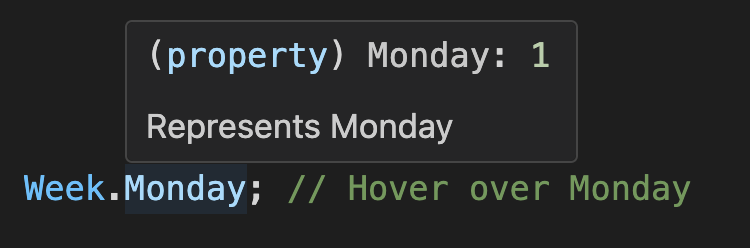

<!-- markdownlint-disable MD001 MD009 MD033 MD041 -->

[English](./README.md) | [中文](./README.zh-CN.md) | [CHANGELOG](./CHANGELOG.md)

<p align="center">
  <a href="https://github.com/shijistar/enum-plus" target="blank">
    
  </a>
</p>

<p align="center">
  <strong>Like native enum, but much better!</strong>
</p>
<br/>

[](https://www.npmjs.com/package/enum-plus)
[](https://www.npmjs.com/package/enum-plus?activeTab=code)
[](https://www.npmjs.com/package/enum-plus)
[](https://codecov.io/gh/shijistar/enum-plus)


**Supported Platforms**

[](https://github.com/shijistar/enum-plus)
[![Web Browsers](https://img.shields.io/badge/Web%20Browser-2185D0?logo=data:image/png;base64,iVBORw0KGgoAAAANSUhEUgAAABgAAAAYCAMAAADXqc3KAAABa1BMVEUAAAD/1kZap04co1BLr1H/1kZKr0//zDbmXC6IzZv95Y390jpLr09Lr0//1kT/1kU8rE/aeibNi13NfUz3kUrDjVrZaTjZWib2YSn2YSj3iC33xRp7q1/91kX9211cuWxBsWv81VL/10f1jhX411Uqpk771Ub2byLNazVTq0xAq09Lr0/91EBAqk6SwFkipFD8zi/GZiz1dSHGYCb2dSDKykirw0oup0/6yiO2dzn2fhuzdDVKrlD1fxv1gBtHrU+hcCr4wRT3Vi1Lr1D/1kVHr1D+1T//10b3Uyr3TyUel+wWj+f2hhn6yiT3SR74wxOn2PmdzfINh+FErVA8rFAxqFD90Tf8zjD2Ow3j8/7g7/sinO8Zk+kRi+QIgt73RBin1fYto/EMgt3J58z88MLYvJxBrVA5qlAqplAkpFD0WC33QBOu3Pvf7vre7vqgzfG748v97rtRqk1knUSBiDembSftUiTFWBrhRxFiNA5aAAAAQnRSTlMAUQX89dtVBfv6+fHapqSJUQ39/f38/Pz7+/j48/Py8fHx7+7s6+fj4t7d3NjX1dXRz8/OzsHApqWTk46MiomAfUvELz/2AAABGUlEQVQoz52P11rCQBBGQ4mhKIK999577ytKEo2JgiaxgAIWsPfHd3Z2JXDLuTzn+ydZoWwiy0O+XK55cCVS6ld9sR1G03qRdk/LcgwKY8YJs5qGgTP377fMpCYXlw1+aPg3T0tDTV3LAdIrYaggn2Ze+85aum69tR5RtjFUEfJjJrOP1+eKksocUpYwVBLyYTZa4C9U1e4+A6YweAkhX7U69ZfHRuAUCBbCe72O/soI7AFBfgposxXqb547aBjjH6ekUyr4l8wuJcR/F4h607ZhPL32YXCxB46Cj57cdvr9XRPoRUlgEwzxu8SDZ4APOGt0EE/cexbQVwsFNtmgv30fAO8QHqGDedAi3nFwhxcnx3vEkEsSyuUPnANWVoDZ/WEAAAAASUVORK5CYII=)](https://www.npmjs.com/package/enum-plus)
[](https://reactnative.dev)
[](https://developers.weixin.qq.com/miniprogram/en/dev/framework)
[![Taro](https://img.shields.io/badge/Taro-18BCF2?logo=data:image/png;base64,iVBORw0KGgoAAAANSUhEUgAAACkAAAAcCAMAAADLCWbaAAABSlBMVEUAAAAAL7MAJ7QAKrcAJ7NxyP90zP8Pev8Tfv8Tff8Uff8Rff9zyv8Tgv8AT9hzy/8Uf/9zyv8Uff8TfP8AJ7Ryyv8AJ7UVff8AJ7IUfv8Tfv8AJrVzyf8Sff8Te/8Vfv8DKbsTev8Mef8Maextv/8AM60AKLZ1zP8Vfv8AKbQAJ7Rvxv8AKLRuxP8AJ7R0y/8MXuIFQ8tzy/8AKLR0y/8BLbkUfv8AJ7Ryyf90yf9Hpv9zyf8Vff8AJrQPbPFyyv9zyv9zy/8AJ7RGo/8Sfv8AKbFivv8Se/9wzP8AI65t2/8Ufv8AKLR0yv8AKbgWg/93zv92zf91y/8WhP8Xgf9ivP8ojv8UgP8AJrMWhf8FP8hMrP8UffwJUtoDNsEBLrx30P9txP9kvv9atf9Tr/89nv8qjv8kiv8Whv8Sd/gRbvEOZegMXOIIStE2vhD3AAAAS3RSTlMACeQkszTNDH24nYFbFgTv7uTb1dXMmF9UTUVDPTcvKSkiHhMODPr59vXx7uzd3djSysPBwL28t66rpqCTk4SCfHZwZlU+Jx0ZFgduc4qrAAABVElEQVQ4y42QV1PCQBCAo4ihF+m923vvvQu5BIIxIGDv/v9Xb+9B9jJzjt/j3jf37awkxhOs1/osstmAhYoPpstqDbEPo5PwIM90nE7Tc5xphx+XlCqHMpGi4wM/jgclysVo1WKGbXS8oSGzvgVmXLGYvZWSLJ9GcFzzUNEX5U2l1Zl3uN2bUxoyx85hzVlOvGm9E9IgRruG4xGI5y3xb3IFPGo4vgfmIf9l70sH8aWJTTUN5hpvdj+Y+XyP4/4yFSuTljVvWfxJ1QCVcbd+Sc2U5ZYdtqbefmgCM8MMD8R3FI7up87M12vGkZ1RBjM6xLFA478YoaLUx8aR320gk2yXJBFeF0GmeSwJyY4YyAxkxWaCizvPhKLsxqbpkIVmYRWvqSfF8cw4FkM5oeiLmXhNl/efN3qLieM5fCMjkBGbSf5GBfGNHNhs/HGjopPgPxP86w8TLLu5GsqeugAAAABJRU5ErkJggg==)](https://docs.taro.zone/en/docs)

⬇️ &nbsp;[Introduction](#introduction) | [Features](#features) | [Installation](#installation) | [Enum Initialization](#enum-initialization) | [API](#api) | [Static Methods](#static-methods) | [User Stories](#user-stories) | [Plugin System](#plugin-system) | [Localization](#localization) | [Extensibility](#extensibility) | [Naming Conflicts](#naming-conflicts) | [Best Practices](#best-practices) | [Compatibility](#compatibility) | [Q&A](#qa) | [Support](#support)&nbsp; ⬇️

> **🎉 v3.0 is Released!**
>
> The new version is a major milestone that brings many exciting features and improvements. Please refer to the [Release Notes](./docs/release-v3.md) and [Migration Guide](./docs/migration-guide-v2-to-v3.md) for details.

## Introduction

`enum-plus` is an enhanced enumeration library that is fully compatible with the native `enum` and serves as a drop-in replacement library. It supports adding display text to enum items and extending more custom metadata fields. Enums can be generated into various UI components such as dropdowns and menus, which greatly simplifies front-end development.

It also provides many extension methods for iterating over enum items and data transformations. You can convert values directly into names in the current language, since it supports internationalization. It's very useful for displaying business data in the UI.

It is a lightweight, zero-dependency library, and it works with any front-end framework, including vanilla projects.

What other exciting features are there? Please continue to explore! Or you can check out this video first.

<p align="center">
  
</p>

<details>
  <summary>Here are some hot questions, feel free to check them out</summary>
  
  - [Why do I need this library? TypeScript already has the built-in enums](#why-do-i-need-this-library-typescript-already-has-the-built-in-enums)
  - [Do I have to install TypeScript? What if my project is in JavaScript?](#do-i-have-to-install-typescript-what-if-my-project-is-in-javascript)
  - [How about the performance of this library?](#how-about-the-performance-of-this-library)
  - [It seems that TypeScript is going to deprecate enum?](#it-seems-that-typescript-is-going-to-deprecate-enum)
  - [I have a great idea and would like to contribute to this project. What should I do?](#i-have-a-great-idea-and-would-like-to-contribute-to-this-project-what-should-i-do)
  
</details>

## Features

- Compatible with the usage of native enums
- Supports multiple data types such as `number` and `string`
- Enhanced enum items with display names
- Internationalization support for display names, can be integrated with any i18n library
- Converts values directly into display names, simplifying data display in the UI
- Extensible design, allowing custom metadata fields for enum items
- Plugin system design, extending enum functionality through plugin installations
- Supports type narrowing to enhance type safety<sup>_&nbsp;&nbsp;TypeScript_</sup>
- Generates dropdowns from enums, compatible with UI libraries like [Ant Design](https://ant.design/components/overview), [Element Plus](https://element-plus.org/en-US/component/overview), [Material-UI](https://mui.com/material-ui) and more
- Supports server-side rendering (SSR)
- Compatible with various environments including Browsers, Node.js, React Native, Taro, and mini-programs
- Compatible with any front-end development framework, including vanilla projects
- TypeScript‑oriented, providing excellent type inference and code completion capabilities
- Zero dependencies
- Lightweight (only 2KB+ minzipped)

## Installation

Install using npm:

```bash
npm install enum-plus
```

Install using pnpm:

```bash
pnpm add enum-plus
```

Install using bun:

```bash
bun add enum-plus
```

Or using yarn:

```bash
yarn add enum-plus
```

**Runs in the Browser**:

- The specific version:

```html
<!-- Modern version, ES2020 compatible -->
<script src="https://cdn.jsdelivr.net/npm/enum-plus@v3.0.0/umd/enum-plus.min.js"></script>
<!-- Legacy version, ES2015 compatible -->
<script src="https://cdn.jsdelivr.net/npm/enum-plus@v3.0.0/umd/enum-plus-legacy.min.js"></script>
```

- The latest version:

```html
<!-- Modern version, ES2020 compatible -->
<script src="https://cdn.jsdelivr.net/npm/enum-plus/umd/enum-plus.min.js"></script>
<!-- Legacy version, ES2015 compatible -->
<script src="https://cdn.jsdelivr.net/npm/enum-plus/umd/enum-plus-legacy.min.js"></script>
```

⬇️ **Download**:

- [enum-plus.umd.min.js.gz](https://github.com/shijistar/enum-plus/releases/download/v3.0.0/enum-plus.umd.min.js.gz)
- [enum-plus.umd.tar.gz](https://github.com/shijistar/enum-plus/releases/download/v3.0.0/enum-plus.umd.tar.gz) (Full package with sourcemap)
- [enum-plus-legacy.umd.min.js.gz](https://github.com/shijistar/enum-plus/releases/download/v3.0.0/enum-plus-legacy.umd.min.js.gz)
- [enum-plus-legacy.umd.tar.gz](https://github.com/shijistar/enum-plus/releases/download/v3.0.0/enum-plus-legacy.umd.tar.gz) (Full package with sourcemap)

> You can also download these files from the [GitHub Releases](https://github.com/shijistar/enum-plus/releases/tag/v3.0.0).

## Enum Initialization

This section shows the various ways to initialize enums using the `Enum` function. Understanding these different initialization formats allows you to choose the most convenient approach for your specific use case.

### 1. Key-Value Format

The simplest format is a direct mapping of keys to values. This is similar to the native enum format.

```js
import { Enum } from 'enum-plus';

// With number values
const WeekEnum = Enum({
  Sunday: 0,
  Monday: 1,
});

WeekEnum.Monday; // 1

// With string values
const WeekEnum2 = Enum({
  Sunday: 'Sun',
  Monday: 'Mon',
});

WeekEnum2.Monday; // 'Mon'
```

> If your project uses TypeScript and the version is below 5.0, it is recommended to add the `as const` type assertion to the parameter of the `Enum` method. In this way, the enum values will remain their original literal values instead of being converted to `number` or `string`. For more details, please refer to [here](#do-i-have-to-upgrade-typescript-to-version-50).

### 2. Standard Format (Recommended)

The standard format includes both a `value` and a `label` for each enum item. This is the most commonly used format and is recommended for most cases. This format allows you to specify a display name for each enum item, which can be used in UI components. Please refer to the [Localization](#localization) section for internationalization support.

```js
import { Enum } from 'enum-plus';

const WeekEnum = Enum({
  Sunday: { value: 0, label: 'I love Sunday' },
  Monday: { value: 1, label: 'I hate Monday' },
});

WeekEnum.Sunday; // 0
WeekEnum.items[0].key; // 'Sunday'
WeekEnum.items[0].label; // I love Sunday
```

### 3. Label-Only Format

Create an enumeration that only provides the `key` and `label` fields. If the `value` field is omitted, it defaults to the same value as the key  field.

```js
import { Enum } from 'enum-plus';

const WeekEnum = Enum({
  Sunday: { label: 'I love Sunday' },
  Monday: { label: 'I hate Monday' },
});

WeekEnum.Sunday; // 'Sunday'
WeekEnum.items[0].key; // 'Sunday'
WeekEnum.items[0].label; // I love Sunday
```

### 4. Array Format

The array format is useful when you need to create enums with dynamic data, for example the data from an API.

You can also use dynamic field mapping rules to adapt to various different data structures. Please refer to the [Custom Field Mapping](#-custom-field-mapping-in-array-format-initialization) section for more details.

```js
import { Enum } from 'enum-plus';

const pets = [
  { value: 1, key: 'Dog', label: 'Dog' },
  { value: 2, key: 'Cat', label: 'Cat' },
  { value: 3, key: 'Rabbit', label: 'Rabbit' },
];
const PetEnum = Enum(pets);

PetEnum.Dog; // 1
PetEnum.label(1); // Dog
```

### 5. Native Enum Format

Create from native enums. It benefits from the native enum's `auto-incrementing` behavior.

```ts
import { Enum } from 'enum-plus';

enum init {
  Sunday = 0,
  Monday,
  Tuesday,
  Wednesday,
  Thursday,
  Friday,
  Saturday,
}
const WeekEnum = Enum(init);

WeekEnum.Sunday; // 0
WeekEnum.Monday; // 1
WeekEnum.Saturday; // 6
```

## API

### 💎 &nbsp; Pick enum values

`Enum.XXX`

Works like native `enum`, allowing you to access enum values directly.

```js
WeekEnum.Sunday; // 0
WeekEnum.Monday; // 1
```

---

### 💎 &nbsp; named

`Record<string, EnumItemClass>`

An object that aggregates all enum items, allowing quick access to a specific enum item object through its `key`.

```js
WeekEnum.named.Monday; // { key: 'Monday', value: 1, label: 'Monday' }
```

### 💎 &nbsp; items

`{ value, label, key, raw }[]`

Returns a read-only array of all enum items.

```js
WeekEnum.items; // [ { value: 0, label: 'Sunday', key:  'Sunday' }, { value: 1, label: 'Monday', key: 'Monday' }, ... ]
```

---

### 💎 &nbsp; values

`(string | number)[]`

Returns an array of all enum item `value`(s).

```js
WeekEnum.values; // [0, 1, 2, 3, 4, 5, 6]
```

---

### 💎 &nbsp; labels

`string[]`

Returns an array of all enum item `label`(s). If [localization](#localization) has been enabled, the localized texts of each enum item will be returned.

```js
WeekEnum.labels; // ['Sunday', 'Monday', ... 'Friday', 'Saturday']
```

---

### 💎 &nbsp; keys

`string[]`

Returns an array of all enum item `key`(s)

```js
WeekEnum.keys; // ['Sunday', 'Monday', 'Tuesday', 'Wednesday', 'Thursday', 'Friday', 'Saturday']
```

---

### 💎 &nbsp; meta

`Record<string, any[]>`

Returns an object containing arrays of custom field values for all enum items. Each key in the object corresponds to a custom field name, and the value is an array of that field's values across all enum items.

```js
const ColorEnum = Enum({
  Red: { value: 1, label: 'Red', hex: '#FF0000' },
  Green: { value: 2, label: 'Green', hex: '#00FF00' },
  Blue: { value: 3, label: 'Blue', hex: '#0000FF' },
});
ColorEnum.meta.hex; // ['#FF0000', '#00FF00', '#0000FF']
```

Aditionally, you can quickly access custom fields of an enum item through the `named` and `raw` property.

```js
ColorEnum.named.Red.raw.hex; // '#FF0000'
```

---

### 💎 &nbsp; has

<sup>**_\[F]_**</sup> &nbsp; `has(keyOrValue?: string | number): boolean`

Check if the value or key of an enum item exists.

```js
WeekEnum.has(1); // true
WeekEnum.has('Sunday'); // true
WeekEnum.has(9); // false
WeekEnum.has('Birthday'); // false
```

---

### 💎 &nbsp; findBy

<sup>**_\[F]_**</sup> &nbsp; `findBy(field: string, value: any): EnumItemClass | undefined`

Find an enum item by a specific field and its value. Returns the enum item object if found, otherwise returns `undefined`.

The `field` parameter can be one of the built-in fields: `key`, `value`, `label`, or any custom field defined in the enum.

```js
WeekEnum.findBy('value', 1); // { key: 'Monday', value: 1, label: 'Monday' }
WeekEnum.findBy('key', 'Monday'); // { key: 'Monday', value: 1, label: 'Monday' }
```

> If you want to get the custom fields of a known enum item, it is recommended to use the `named` property to access it

---

### 💎 &nbsp; label

<sup>**_\[F]_**</sup> &nbsp; `label(keyOrValue?: string | number): string | undefined`

Gets the display name of an enum item according to its value or key. If [localization](#localization) has been enabled, the localized text will be returned.

```js
WeekEnum.label(1); // Monday
WeekEnum.label('Monday'); // Monday, here is label, not key
```

---

### 💎 &nbsp; key

<sup>**_\[F]_**</sup> &nbsp; `key(value?: string | number): string | undefined`

Find the key of an enum item by its value. It's also known as [reverse mapping](https://www.typescriptlang.org/docs/handbook/enums.html#reverse-mappings). If not found, `undefined` is returned.

```js
WeekEnum.key(1); // Monday (here is key, not label)
```

---

### 💎 &nbsp; raw

<sup>**_\[F^1]_**</sup> &nbsp; `raw(): Record<K, T[K]>`
<br/>
<sup>**_\[F^2]_**</sup> &nbsp; `raw(keyOrValue: V | K): T[K]`

The `raw` method has two overloads. The first one is to return the original initialization object of the whole enum collection, i.e. the first parameter of the `Enum` method.

The second one is to return the original initialization object of a single enum item, i.e. the sub-object of the corresponding field in the first parameter of the `Enum` method.

The main purpose of the `raw` method is to get the extended custom fields of the enum items.

```js
const WeekEnum = Enum({
  Sunday: { value: 0, label: 'Sunday', happy: true },
  Monday: { value: 1, label: 'Monday', happy: false },
});

WeekEnum.raw(0).happy; // true
WeekEnum.raw(0); // { value: 0, label: 'Sunday', happy: true }
WeekEnum.raw('Monday'); // { value: 1, label: 'Monday', happy: false }
WeekEnum.raw(); // { Sunday: { value: 0, label: 'Sunday', happy: true }, Monday: { value: 1, label: 'Monday', happy: false } }
```

> Tips: If you want to access the metadata fields of a known enum item, using `enum.named.XXX.raw` is a good option, for example: `WeekEnum.named.Sunday.raw.happy`.

---

### 💎 &nbsp; toList

<sup>**_\[F^1]_**</sup> &nbsp; `toList(): { value, label }[]`
<br/>
<sup>**_\[F^2]_**</sup> &nbsp; `toList(options?: { valueField?: string; labelField?: string }): { [key: string]: any }[]`

Converts the enum items to an array of objects, each containing `value` and `label` fields by default. You can customize the field names using the `options` parameter.

```js
WeekEnum.toList();
// [
//   { value: 1, label: 'Monday' },
//   { value: 2, label: 'Tuesday' },
//   ...
// ]
WeekEnum.toList({ valueField: 'id', labelField: 'name' });
// [
//   { id: 1, name: 'Monday' },
//   { id: 2, name: 'Tuesday' },
//   ...
// ]
```

---

### 💎 &nbsp; toMap

<sup>**_\[F^1]_**</sup> &nbsp; `toMap(): Record<string, string | number>`
<br/>
<sup>**_\[F^2]_**</sup> &nbsp; `toMap(options?: { keySelector?: string; valueSelector?: string }): Record<string, any>`

Converts the enum items to a key-value map object, where the keys are the enum values and the values are the enum labels by default. You can customize the key and value fields using the `options` parameter.

```js
WeekEnum.toMap();
// {
//   "1": 'Monday',
//   "2": 'Tuesday',
//   ...
// }
WeekEnum.toMap({ keySelector: 'key', valueSelector: 'value' });
// {
//   "Monday": 1,
//   "Tuesday": 2,
//   ...
// }
```

---

### 💎 &nbsp; name

`string`

The display name of the whole enum collection. It's optional and can be set as the second parameter of the `Enum` method. This name can be either a plain string or a localization key to support internationalized text. Please refer to the [Localization](#localization) section for more details.

```js
const WeekEnum = Enum(
  {
    Sunday: { value: 0, label: 'Sunday' },
    Monday: { value: 1, label: 'Monday' },
  },
  {
    name: 'i18n.enums.week', // A regular string or localization key
  }
);

WeekEnum.name; // Week or 周, depending on the current language setting
```

> Enums are usually used to generate dropdown menus in forms, or show item text in table cells. The display name of the enum type often serves as the form field label or table caption. By utilizing the `name` property, you can centralize the management of both the enum type's display name and its items' labels, simplifying maintenance and ensuring consistency across your application.

---

### ⚡️ &nbsp; valueType &nbsp; <sup>**_\[TypeScript Only]_**</sup>

`value1 | value2 | ...`

In TypeScript, provides a union type containing all enum values. It's usually used for type constraints on variables and method parameters, or used in component properties.

```ts
const weekValue: typeof WeekEnum.valueType = 1;

function setToday(day: typeof WeekEnum.valueType) {
  // ...
}

const MyComponent = (props: { day: typeof WeekEnum.valueType }) => {
  // ...
};
```

> Note: This is a TypeScript type and cannot be called at runtime. Calling it at runtime will throw an error.

---

### ⚡️ &nbsp; keyType &nbsp; <sup>**_\[TypeScript Only]_**</sup>

`key1 | key2 | ...`

Similar to `valueType`, provides a union type of all enum keys in TypeScript.

```ts
type WeekKeys = typeof WeekEnum.keyType; // 'Sunday' | 'Monday'

const weekKey: typeof WeekEnum.keyType = 'Monday';
const weekKeys: (typeof WeekEnum.keyType)[] = ['Sunday', 'Monday'];
```

> Note: This is a TypeScript type and cannot be called at runtime. Calling it at runtime will throw an error.

---

### ⚡️ &nbsp; rawType &nbsp; <sup>**_\[TypeScript Only]_**</sup>

`{ value: V, label: string, [...] }`

Provides a type of the original initialization object of the whole enum collection, i.e. the type of the first parameter of the `Enum` method.

Do not confuse it with the `raw` method. The `raw` method is a runtime method, while `rawType` is a TypeScript type.

```ts
type WeekRaw = typeof WeekEnum.rawType;
// { Sunday: { value: 0, label: string }, Monday: { value: 1, label: string } }
```

> Note: This is a TypeScript type and cannot be called at runtime. Calling it at runtime will throw an error.

---

## Static Methods

### 💎 &nbsp; Enum.isEnum

<sup>**_\[F]_**</sup> &nbsp; `isEnum(obj: any): boolean`

Check if a given object is an instance created by the `Enum` function.

```js
Enum.isEnum(WeekEnum); // true
Enum.isEnum({}); // false
```

---

### 💎 &nbsp; Enum.localize

<sup>**_\[F]_**</sup> &nbsp; `(key: string) => string`

Set a global localization function for all enums. This function will be used to get the localized text for enum items and enum type names. Please refer to the [Localization](#localization) section for more details.

```js
import i18n from 'i18next';

Enum.localize = (key) => i18n.t(key);
```

---

### 💎 &nbsp; Enum.extends

<sup>**_\[F]_**</sup> &nbsp; `(obj: Record<string, unknown> | undefined) => void`

Extend the `Enum` objects with custom methods. More details can be found in the [Extensibility](#extensibility) section.

```js
Enum.extends({
  sayHello() {
    return `Hello EnumPlus!`;
  },
});
```

---

### 💎 &nbsp; Enum.install

<sup>**_\[F]_**</sup> &nbsp; `(plugin: Plugin, options?: any) => void`

Install a plugin to extend the functionality of all enums. More details can be found in the [Plugin System](#plugin-system) section.

```js
import i18nextPlugin from '@enum-plus/plugin-i18next';

Enum.install(i18nextPlugin);
```

---

## User Stories

### 💡 Prevent Magic Numbers

```js
const WeekEnum = Enum({
  Sunday: { value: 0, label: 'Sunday' },
  Monday: { value: 1, label: 'Monday' },
});

if (today === WeekEnum.Sunday) {
  // It's Sunday, enjoy your day!
} else if (today === WeekEnum.Monday) {
  // Oh no, it's Monday again...
}
```

---

### 💡 Check for Valid Enum Values

```js
if (WeekEnum.has(value)) {
  // It's a valid enum value, safe to use
} else {
  // Throw an error or use a default value
}
```

---

### 💡 Check for Enum Objects

```ts
let values: number[] | undefined;
if (Enum.isEnum(data)) {
  values = data.values;
} else if (Array.isArray(data)) {
  values = data;
} else {
  // Throw an error or use a default value
}
```

---

### 💡 Generate UI Controls

Take React and Ant Design as examples. Please refer to the [Supports Various Frontend Frameworks](#-supports-various-frontend-frameworks) section for more examples.

```jsx
import { Menu, Select, Table } from 'antd';
import { ProFormCheckbox, ProFormSelect } from '@ant-design/pro-components';

const App = () => {
  return (
    <>
      <Select options={WeekEnum.items} />
      <Menu items={WeekEnum.toMenu()} />
      <Table columns={[{ filters: WeekEnum.toFilter() }]} />
      <ProFormSelect valueEnum={WeekEnum.toValueMap()} />
      <ProFormCheckbox valueEnum={WeekEnum.toValueMap()} />
    </>
  );
};
```

> Need to install [@enum-plus/plugin-antd](https://github.com/shijistar/enum-plus/tree/main/packages/plugin-antd) plugin

---

### 💡 Internationalization for Enum Names and Labels

Internationalization support . Set the `label` field to a localization key, so that it displays the corresponding text based on the current language environment. Please refer to the [Localization](#localization) section for more details.

```js
WeekEnum.label(1); // Monday or 星期一, depending on the current locale
WeekEnum.named.Monday.label; // Monday or 星期一, depending on the current locale
WeekEnum.name; // Week or 周, depending on the current locale
```

---

### 💡 Type Narrowing &nbsp; <sup>**_\[TypeScript Only]_**</sup>

Type narrowing is a TypeScript-specific feature that allows you to use `valueType` to constrain the types of variables, function parameters, or component props. This prevents invalid assignments and enhances type safety in your code.

- Variables

```ts
type WeekValues = typeof WeekEnum.valueType; // 0 | 1 | ... | 5 | 6

const weekValue: WeekValues = 1; // ✅ Correct, 1 is a valid week enum value
const weeks: WeekValues[] = [0, 1]; // ✅ Correct, 0 and 1 are valid week enum values

const badWeekValue: WeekValues = "Weekend"; // ❌ Type error, "Weekend" is not a number
const badWeekValue: WeekValues = 8; // ❌ Error, 8 is not a valid week enum value
const badWeeks: WeekValues[] = [0, 8]; // ❌ Error, 8 is not a valid week enum value
```

- Function Parameters

```ts
function setDay(day: typeof WeekEnum.valueType) {
  // The type of day is narrowed to 0 | 1 | ... | 5 | 6
}

setDay(1); // ✅ Correct
setDay('Monday'); // ❌ Type error
setDay(8); // ❌ Error, 8 is not a valid enum value
```

- Component Props

```ts
type MyComponentProps = {
  day: typeof WeekEnum.valueType; // 0 | 1 | ... | 5 | 6
};
const MyComponent = (props: MyComponentProps) => {
  return <div>Today is {WeekEnum.label(props.day)}</div>;
};

<MyComponent day={1} />; // ✅ Correct
<MyComponent day="Monday" />; // ❌ Type error, "Monday" is not a number
<MyComponent day={8} />; // ❌ Error, 8 is not a valid enum value
```

---

### 💡 Support Metadata Fields That Can Serve as a Static Configuration System

```js
const ColorEnum = Enum({
  Red: { value: 1, hex: '#FF0000', icon: '🔥' },
  Green: { value: 2, hex: '#00FF00', icon: '🍏' },
  Blue: { value: 3, hex: '#0000FF', icon: '🔵' },
});

ColorEnum.values; // [1, 2, 3]
ColorEnum.keys; // ['Red', 'Green', 'Blue']
ColorEnum.meta.hex; // ['#FF0000', '#00FF00', '#0000FF']
ColorEnum.meta.icon; // ['🔥', '🍏', '🔵']
ColorEnum.named.Red.raw.hex; // '#FF0000'
ColorEnum.named.Red.raw.icon; // '🔥'
```

---

### 💡 Supports Traversing Enum Items in a Read-Only Manner

```js
Array.isArray(WeekEnum.items); // true
WeekEnum.items.map((item) => item.value); // [0, 1, ..., 5, 6]
WeekEnum.items.forEach((item) => {
  // ✅ Traversable
});
for (const item of WeekEnum.items) {
  // ✅ Traversable
}

WeekEnum.items.push({ value: 2, label: 'Tuesday' }); // ❌ Not allowed, read-only
WeekEnum.items.splice(0, 1); // ❌ Not allowed, read-only
WeekEnum.items[0].label = 'foo'; // ❌ Not allowed, read-only
```

---

### 💡 Enum Composition (Merging)

```js
const PrimaryColorEnum = Enum({
  Red: { value: 1, hex: '#FF0000' },
  Green: { value: 2, hex: '#00FF00' },
  Blue: { value: 3, hex: '#0000FF' },
});
const SecondaryColorEnum = Enum({
  Yellow: { value: 4, hex: '#FFFF00' },
  Cyan: { value: 5, hex: '#00FFFF' },
  Magenta: { value: 6, hex: '#FF00FF' },
});
const AllColorEnum = Enum({
  ...PrimaryColorEnum.raw(),
  ...SecondaryColorEnum.raw(),
});
```

---

### 💡 Supports JSDoc Comments on Enum Items, Enabling Code Intelligence

Supports inline documentation through JSDoc, allowing engineers to view detailed comments by simply hovering over enum values in the editor. Please refer to the [Best Practices](./docs/best-practices.md) section for how to write good code.

```js
const WeekEnum = Enum({
  /** Represents Sunday */
  Sunday: { value: 0, label: 'Sunday' },
  /** Represents Monday */
  Monday: { value: 1, label: 'Monday' },
});

WeekEnum.Monday; // Hover over Monday
```



We can see that both the enumeration value and the description of the enumeration item can be displayed at the same time, when the cursor hovers over an enumeration item. There is no need to jump away from the current position in the code to check the definitions.

---

### 💡 Supports Various Frontend Frameworks

`Enum.items` can be consumed as the data source of UI components. Take `Select` component as examples.

- **React-based UI libraries**

  [Ant Design](https://ant.design/components/select) | [Arco Design](https://arco.design/react/en-US/components/select) Select

  ```tsx
  import { Select } from 'antd';

  <Select options={WeekEnum.items} />;
  ```

  [Material-UI](https://mui.com/material-ui/react-select/) Select

  ```tsx
  import { MenuItem, Select } from '@mui/material';

  <Select>
    {WeekEnum.items.map((item) => (
      <MenuItem key={item.value} value={item.value}>
        {item.label}
      </MenuItem>
    ))}
  </Select>;
  ```

  [Kendo UI](https://www.telerik.com/kendo-react-ui/components/dropdowns/dropdownlist) Select

  ```tsx
  import { DropDownList } from '@progress/kendo-react-dropdowns';

  <DropDownList data={WeekEnum.items} textField="label" dataItemKey="value" />;
  ```

- **Vue-based UI libraries**

  [Element Plus](https://element-plus.org/en-US/component/select.html) Select

  ```html
  <el-select>
    <el-option v-for="item in WeekEnum.items" v-bind="item" />
  </el-select>
  ```

  [Ant Design Vue](https://antdv.com/components/select) | [Arco Design](https://arco.design/vue/en-US/component/select) Select

  ```html
  <a-select :options="WeekEnum.items" />
  ```

  [Vuetify](https://vuetifyjs.com/en/components/selects/) Select

  ```html
  <v-select :items="WeekEnum.items" item-title="label" />
  ```

- **Angular-based UI libraries**

  [Angular Material](https://material.angular.io/components/select/overview) Select

  ```html
  <mat-select>
    @for (item of WeekEnum.items; track item.value) {
    <mat-option [value]="item.value">{{ item.label }}</mat-option>
    }
  </mat-select>
  ```

  [NG-ZORRO](https://ng.ant.design/components/select/en) Select

  ```jsx
  <nz-select>
    @for (item of WeekEnum.items; track item.value) {
      <nz-option [nzValue]="item.value">{{ item.label }}</nz-option>
    }
  </nz-select>
  ```

---

### 💡 Custom Field Mapping in Array Format Initialization

In [4. Array Format](#4-array-format) section, we know that you can build an enum from dynamic data from the backend, but it is very likely that the field names of dynamic data are not `value`, `label`, `key`, but other field names. In this case, you can pass in a custom option to map these to other field names.

```js
import { Enum } from 'enum-plus';

const data = await getPetsData();
// [   { id: 1, code: 'dog', name: 'Dog' },
//     { id: 2, code: 'cat', name: 'Cat' },
//     { id: 3, code: 'rabbit', name: 'Rabbit' }   ];
const PetTypeEnum = Enum(data, {
  getValue: 'id',
  getLabel: 'name',
  getKey: 'code', // getKey is optional
});
PetTypeEnum.items; // The output is:
// [   { value: 1, label: 'Dog', key: 'dog' },
//     { value: 2, label: 'Cat', key: 'cat' },
//     { value: 3, label: 'Rabbit', key: 'rabbit' }   ]
```

`getValue`, `getLabel`, `getKey` can also be a function to handle more complex business logic, for example:

```js
const PetTypeEnum = Enum(petTypes, {
  getValue: (item) => item.id,
  getLabel: (item) => `${item.name} (${item.code})`,
  getKey: (item) => item.code,
});
```

---

## Plugin System

`enum-plus` provides a plugin system that allows you to extend the functionality of all enums. Plugins can add new methods or properties to all enum instances, greatly enhancing their capabilities. You can choose to install only the plugins you need, keeping the core library lightweight and efficient.

```ts
import antdPlugin from '@enum-plus/plugin-antd';
import { Enum } from 'enum-plus';

Enum.install(antdPlugin);
```

After installing a plugin, it will add new methods or properties to all enum instances. For example, after installing the `@enum-plus/plugin-antd` plugin, you can use the `enum.toSelect` method to generate a Select component from the enum.

Optionally, you can provide configuration options to customize the behavior of the plugin. For details on the configuration options for each plugin, please refer to the documentation of the respective plugins.

```ts
import antdPlugin from '@enum-plus/plugin-antd';
import { Enum } from 'enum-plus';

Enum.install(antdPlugin, {
  toSelect: {
    valueField: 'id', // Sets the field representing the value in the data object generated by the toSelect method
    labelField: 'name', // Sets the field representing the label in the data object generated by the toSelect method
  },
});
```

### Awesome Plugins

The following plugins are available. You can choose to install them based on your needs:

- [@enum-plus/plugin-antd](https://github.com/shijistar/enum-plus/tree/main/packages/plugin-antd): Ant Design oriented features, including `enum.toSelect`, `enum.toMenu`, `enum.toFilter`, and `enum.toValueMap`. With these methods, you can directly bind enums to the corresponding Ant Design components, greatly simplifying your code.
- [@enum-plus/plugin-i18next](https://github.com/shijistar/enum-plus/tree/main/packages/plugin-i18next): Automatically adapts to [i18next](https://www.i18next.com) to enable internationalization support for enums.
- [@enum-plus/plugin-react-i18next](https://github.com/shijistar/enum-plus/tree/main/packages/plugin-react-i18next): Automatically adapts to [react-i18next](https://react.i18next.com) to enable internationalization support for enums.
- [@enum-plus/plugin-react](https://github.com/shijistar/enum-plus/tree/main/packages/plugin-react): React integration, including support for `Enum.localize` to return React components, and listening for language changes to auto re-render components.
- We are working on the following plugins:
  - [@enum-plus/plugin-vue](https://github.com/shijistar/enum-plus/tree/main/packages/plugin-vue): Vue integration, including support for `Enum.localize` to return Vue components, and listening for language changes to auto re-render components.
  - [@enum-plus/plugin-angular](https://github.com/shijistar/enum-plus/tree/main/packages/plugin-angular): Angular integration, including support for `Enum.localize` to return Angular components, and listening for language changes to auto re-render components. _We need your help to develop this plugin!_

> If the plugin you are searching for is not available, or if you want to develop your own plugin, please refer to the [Plugin Development Guide](./docs/plugin-development.md). You can develop new plugins in the official enum-plus repository or publish your developed plugins to npm and share your plugin links here. We sincerely need your help to enrich the plugin ecosystem!

---

## Localization

`enum-plus` does not include built-in internationalization capabilities by default. Therefore, the `label` field of enum items is treated as a plain string and returns the original text directly.

To add localization support to `enum-plus`, the simplest way is to install the corresponding [i18n plugin](#plugin-system), such as `@enum-plus/plugin-i18next`, which automatically passes the values of the `label` and `name` fields to i18next for translation.

```bash
npm install @enum-plus/plugin-i18next i18next
```

Then install the plugin in the project entry file:

_index.js_

```js
import i18nextPlugin from '@enum-plus/plugin-i18next';
import { Enum } from 'enum-plus';

Enum.install(i18nextPlugin);
```

After installing the plugin, the `label` and `name` fields of the enum will be automatically translated through i18next.

```js
const WeekEnum = Enum(
  {
    Sunday: { value: 0, label: 'week.sunday' },
    Monday: { value: 1, label: 'week.monday' },
  },
  { name: 'weekDays.name' }
);
WeekEnum.label(1); // Monday or 星期一, depending on the current locale
WeekEnum.named.Monday.label; // Monday or 星期一, depending on the current locale
WeekEnum.name; // Week or 周, depending on the current locale
```

This plugin also supports custom i18next options, and even allows complete control over the `localize` method. Please refer to the [plugin documentation](https://github.com/shijistar/enum-plus/tree/main/packages/plugin-i18next#plugin-options) for more details.

If you need to automatically update the UI after switching languages, this requires the capabilities of frameworks like React, Vue, or Angular. Please consider using plugins such as [@enum-plus/plugin-react](https://github.com/shijistar/enum-plus/tree/main/packages/plugin-react) or [@enum-plus/plugin-vue](https://github.com/shijistar/enum-plus/tree/main/packages/plugin-vue).

If you are using other internationalization libraries, such as `react-intl`, `vue-i18next`, or `ngx-translate`, you can integrate these libraries by overwritting the `Enum.localize` method.

_my-extension.js_

```js
import { Enum } from 'enum-plus';

Enum.localize = (key) => {
  // This is a pseudo code, please adjust it according to your own logic
  return intl.formatMessage({ id: key });
};
```

> Once you have completed this feature, it is recommended that you consider publishing it as an npm package and share it in the [Awesome Plugins](#awesome-plugins) section, so that others can benefit from your work. If you believe that this project is very general, you can also consider submitting it to the official [enum-plus](https://github.com/shijistar/enum-plus/tree/main/packages) plugin repository. For specific development rules, please refer to the [Plugin Development Guide](./docs/plugin-development.md).

---

## Extensibility

Enum provides a wealth of built-in methods and properties that can satisfy most common use cases. However, if they are not sufficient, you can use `Enum.extends` to add more custom methods. These extensions will be globally applied to all enum instances, including those created before the extension was applied, and will take effect immediately without any additional setup.

> In fact, the entire [Plugin System](#plugin-system) and the `Enum.install` method are implemented using `Enum.extends` at the underlying level.

- **TypeScript Projects**

  _my-enum-extension.ts_

  ```ts
  // Implementation code
  Enum.extends({
    toMySelect() {
      return this.items.map((item) => ({ value: item.value, title: item.label }));
    },
    reversedItems() {
      return this.items.toReversed();
    },
  });

  // Type declaration for better type hints
  declare module 'enum-plus/extension' {
    export interface EnumExtension<T, K, V> {
      toMySelect: () => { value: V; title: string }[];
      reversedItems: () => EnumItemClass<EnumItemInit<V>, K, V>[];
    }
  }
  ```

  _index.ts_

  Then import this file in the entry file of your project:

  ```ts
  import './my-enum-extension';

  WeekEnum.toMySelect(); // [{ value: 0, title: 'Sunday' }, { value: 1, title: 'Monday' }]
  ```

- **JavaScript Projects**

  _my-enum-extension.js_

  ```js
  import { Enum } from 'enum-plus';

  // Implementation code
  Enum.extends({
    toMySelect() {
      return this.items.map((item) => ({ value: item.value, title: item.label }));
    },
    reversedItems() {
      return this.items.toReversed();
    },
  });
  ```

  _my-enum-extension.js.d.ts_

  ```ts
  import { EnumExtension, EnumItemClass, EnumItemInit } from 'enum-plus';

  // Type declaration for better type hints
  declare module 'enum-plus/extension' {
    export interface EnumExtension<T, K, V> {
      toMySelect: () => { value: V; title: string }[];
      reversedItems: () => EnumItemClass<EnumItemInit<V>, K, V>[];
    }
  }
  ```

  _index.js_

  Then import this file in the entry file of your project:

  ```js
  import './my-enum-extension';

  WeekEnum.toMySelect(); // [{ value: 0, title: 'Sunday' }, { value: 1, title: 'Monday' }]
  ```

Please note that `EnumExtension` is a generic interface that accepts three type parameters, which represent:

- `T`: Initialization object of the enum type (e.g., the object passed to `Enum()`)
- `K`: Key of the enum item (e.g., Sunday, Monday)
- `V`: Value of the enum items

> If you want to provide more friendly type hints in the extension methods, you may need to use these type parameters. However these are all optional, if you don't need them, you can omit them.

---

## Naming Conflicts?

`enum-plus` is designed with naming conflicts in mind. The namespace of enum items is separate from the methods and properties of the enum instance, minimizing the chances of conflicts. For example, when an enum item's name conflicts with a method name, you can access the overridden methods through the `items` property.

```js
import { KEYS, VALUES } from 'enum-plus';

const WeekEnum = Enum({
  foo: { value: 1 },
  bar: { value: 2 },
  keys: { value: 3 }, // Naming conflict
  values: { value: 4 }, // Naming conflict
  label: { value: 5 }, // Naming conflict
  named: { value: 6 }, // Naming conflict
  toList: { value: 7 }, // Naming conflict
});

WeekEnum.foo; // 1
WeekEnum.bar; // 2
// Below are all enum items, which take precedence and override the original methods
WeekEnum.keys; // 3
WeekEnum.values; // 4
WeekEnum.label; // 5
WeekEnum.named; // 6
WeekEnum.toList; // 7

// You can access these overridden methods via .items 🙂
WeekEnum.items[KEYS]; // ['foo', 'bar', 'keys', 'values', 'label', 'named', 'toList']
WeekEnum.items[VALUES]; // [1, 2, 3, 4, 5, 6, 7]
WeekEnum.items.label(1); // 'foo'
WeekEnum.items.named.foo; // { value: 1, label: 'foo', key: 'foo' }
WeekEnum.items.toList(); // [{ value: 1, label: 'foo' }, ...]
```

> Note that `keys` and `values` are special because they are built-in methods of JavaScript arrays. To avoid altering the behavior of the `items` array, you need to use the `KEYS` and `VALUES` symbols as aliases to access them.

For an even more extreme case, what if `items` conflicts with an enum item name? Don't worry, you can still access it via the `ITEMS` alias.

```js
import { ITEMS } from 'enum-plus';

const WeekEnum = Enum({
  foo: { value: 1 },
  bar: { value: 2 },
  items: { value: 3 }, // Naming conflict
  toList: { value: 4 }, // Naming conflict
});

WeekEnum.items; // 3, enum item takes precedence and overrides items
WeekEnum[ITEMS].toList(); // But you can access it via the ITEMS alias
```

---

## Best Practices

When using `enum-plus`, following these best practices can help ensure consistency, maintainability, and clarity in your codebase:

1. **Enum Type Naming:** Use `PascalCase` and append with the `Enum` suffix (e.g., _WeekEnum_, _ColorEnum_).
2. **Enum Item Naming:** Use `PascalCase` for enum items (e.g., _WeekEnum.Sunday_, _ColorEnum.Red_). This naming style highlights the immutability and static nature of enum items, and ensures they appear at the top in IDE IntelliSense suggestions for easier selection.
3. **Semantic Clarity:** Ensure enum and item names have clear semantics. Good semantic naming serves as self-documentation, making code intent explicit and reducing cognitive overhead.
4. **Single Responsibility Principle:** Each enum type should represent a single, cohesive set of related constants. Avoiding overlapping responsibilities between different enum types.
5. **Provide JSDoc Comments:** Provide JSDoc comments for each enum item and the enum type itself, explaining their purpose and usage. Comprehensive documentation enables IDE hover tooltips and improves code readability and maintainability.
6. **Internationalization Architecture:** Plan for internationalization from the outset by leveraging the library's [localization](#localization) features. A well-designed internationalization architecture minimizes future refactoring and facilitates global scalability.

Here is an example that combines the above best practices to define an enum:

```js
/** Represents the days of the week */
const WeekEnum = Enum(
  {
    /** Sunday */
    Sunday: { value: 0, label: 'enums.week.sunday' },
    /** Monday */
    Monday: { value: 1, label: 'enums.week.monday' },
    // ...
    /** Friday */
    Friday: { value: 5, label: 'enums.week.friday' },
    /** Saturday */
    Saturday: { value: 6, label: 'enums.week.saturday' },
  },
  { name: 'enums.week.name' }
);
```

---

## Compatibility

enum-plus is designed to be compatible with a wide range of environments, including modern browsers, Node.js, and various build tools. Below are the compatibility details for different environments:

### Browser Environments

- **Modern Bundlers**: For bundlers supporting the [exports](https://nodejs.org/api/packages.html#exports-sugar) configuration (such as webpack 5+, vite, rollup), imports will be resolved to the `es` directory, which targets **`ES2020`**.

- **Legacy Bundlers**: For older bundlers without [exports](https://nodejs.org/api/packages.html#exports-sugar) support (like Webpack 4), imports will be resolved to the `es-legacy` directory, which targets **`ES2015`**.

- **UMD Version**: For direct browser usage or static projects without bundlers, enum-plus provides UMD format files in the `umd` directory. You can include it via a `<script>` tag and access it through the global `window.EnumPlus`. The UMD directory offers two versions:
  - **enum-plus.min.js**: Targets **`ES2020`**, suitable for modern browsers.
  - **enum-plus-legacy.min.js**: Targets **`ES2015`**, suitable for older browsers.

- **Polyfill Strategy**: enum-plus ships no polyfills to minimize bundle size. For legacy browser support, you can choose from the following polyfill strategies based on your project's needs:
  - `core-js`
  - `@babel/preset-env` with appropriate `useBuiltIns` settings
  - Alternative polyfill implementations

### Node.js Environments

In Node.js environments, you can import enum-plus using either `require` or `import` syntax.

- **require**

  For all Node.js versions that support CommonJS, you can import enum-plus using `require('enum-plus')`. The require statement will be resolved to the `lib` directory, which targets **`ES2015`**. The minimum compatible version is Node.js `v7.x`.

- **import**

  For modern versions of Node.js that support ES Modules (Node.js 14.13+), you can import enum-plus using `import { Enum } from 'enum-plus'`. The imports will be resolved to the `es` directory, which targets **`ES2020`**.

---

## Q&A

### Why do I need this library? TypeScript already has the built-in enums

TypeScript's built-in enum only provides the basic functionality of [Enumeration](https://en.wikipedia.org/wiki/Enumerated_type): eliminating magic numbers, and regulating control flow. However, as a front-end engineer, the needs for enumerations are not merely these. We also need:

1. _Eliminate magic numbers_
2. _Used in the `if` or `switch` statements for conditional branching_
3. **Add display names to enums, and should support internationalization**
4. **Add custom metadata fields, such as color, icon, and description, etc.**
5. **Enums can be generated into various form controls such as dropdowns, menus, tabs, etc.**
6. **Convert values directly into localized names for displaying business data in the UI**

If you need these features, then `enum-plus` is designed for you. If you are a front-end engineer, we strongly recommend you give it a try!

### It seems that TypeScript is going to deprecate enum?

Whether the enum **feature** will be replaced in the future or not, the **concept** of enumeration will never disappear. It is one of the most basic features in many high-level languages.

`enum-plus` was precisely created to make up for the shortcomings of TypeScript's built-in enum. It is a pure runtime library and will not be affected by the development of the TypeScript language. Therefore, you can use it with complete confidence. It will neither become outdated nor be deprecated in the future.

> The TypeScript team does not have a clear plan to deprecate enum. However, it is indeed not supported in [some cases](https://www.typescriptlang.org/tsconfig/#erasableSyntaxOnly). The key reason is that enum is neither a pure TypeScript type (which can be completely removed during compilation) nor pure JavaScript runtime code, but a mixture of the two, which brings significant complexity to the compiler.

### How about the performance of this library?

`enum-plus` always focuses on performance. One of its design goals is to maintain efficient performance while providing rich functionality.

For the basic usage like `WeekEnum.Monday`, the performance is the same as the native enum, because they both directly access the member fields of a JavaScript object at the underlying level.

For operations such as traversing or searching the array of enum items, the performance is the same as that of native arrays, because the underlying level of the Enum collection is a frozen native array.

As you can see, the performance has almost reached its peak, and you can use it with complete confidence without worrying about performance issues.

### Why doesn't Enum support reverse mapping?

Please use the `enum.key(value)` method to get the key name according to its value. This reverse mapping method is applicable to both numeric and string enum values.

### Why does the search function of the Ant Design Select stop working after enabling internationalization?

This is because `Enum.localize` returns a component instance instead of a regular string, causing Ant Design to fail in performing string matching correctly. Please use the `enum.isMatch` method to enable the search functionality. Please refer to [@enum-plus/plugin-react](https://github.com/shijistar/enum-plus/tree/main/packages/plugin-react#dropdown-search) for more details.

```bash
npm install @enum-plus/plugin-react
```

```tsx
import { Select } from 'antd';

<Select options={WeekEnum.items} filterOption={WeekEnum.isMatch} />;
```

> If you are using the `@enum-plus/plugin-i18next` plugin, or have implemented the `Enum.localize` method yourself and it returns a string, then the search functionality in the dropdown should work correctly.

### Do I have to install TypeScript? What if my project is in JavaScript?

Don't worry, whether your project is in TypeScript or JavaScript, `enum-plus` works perfectly fine. Both of them can benefit from type safety and intelligent code completion. You don't have to install TypeScript dependencies in your project, since modern code editors like VSCode have built-in support for TypeScript.

### Do I have to upgrade TypeScript to version 5.0+?

Not necessarily. The purpose of upgrading to TypeScript 5.0 is to provide a better development experience. If you choose not to upgrade, it will still work fine with just a little extra effort.

```ts
const WeekEnum = Enum({
  Sunday: 0,
  Monday: 1,
} as const);
```

As you can see, in earlier versions of TypeScript, you may need to use the `as const` type assertion. `as const` allows the enum values to remain their original literal values instead of being converted to `number` or `string` types. Meanwhile, the `enum.valueType` will remain as `0 | 1` instead of becoming `number`. This makes TypeScript's type checking more accurate and enhances code safety. Additionally, please check your `tsconfig.json` file to ensure that the `moduleResolution` option is set to `node` or `node10`, which prevents the type declaration files of `enum-plus` from being automatically switched to the version of 5.0+.

If you are using JavaScript, you can leverage `jsdoc` to help the editor accurately recognize types.

```js
/** @type {{ Sunday: 0; Monday: 1 }} */
const weekInit = { Sunday: 0, Monday: 1 };

const WeekEnum = Enum(weekInit);
```

### I saw in the release notes that you made Jest and Playwright share the same set of test code, which is interesting. Can you introduce how to achieve this?

Yes, actually it wasn't easy from the beginning. The working principles of Jest and Playwright are quite different. Jest runs in a Node.js environment, while Playwright runs in a browser environment and then returns to the Node.js environment to execute assertions. To make them share a set of test code, we did the following:

1. **Environment Adaptation**: We wrote an [adaptation layer](https://github.com/shijistar/enum-plus/tree/main/test/engines/index.ts) to handle the differences between the two testing frameworks.
2. **Abstract Testing Logic**: We abstracted the testing logic into some independent modules, so that these test suites can be reused in different testing frameworks.
3. **Enhanced Serialization Mechanism**: E2E tests require running in a browser environment and then passing the running results to the Node.js environment for assertions. To achieve this, we developed an [enhanced serialization library](https://github.com/shijistar/jsoneo). Since the `enum-plus` enums internally use types like `class`, `function`, `Symbol`, `Date`, and `RegExp`, built-in functions rewritten like `Symbol.toStringTag` and `Symbol.hasInstance`, and even including `Getter/Setter`, which are not serializable by `JSON.stringify`. We implemented support for these complex features through [jsoneo](https://github.com/shijistar/jsoneo). So complex objects can cross different environments through `serialization/deserialization` while retaining all dynamic behaviors. The transferred object remains "alive", just like the original object has not been serialized.

Based on these efforts, we successfully share a set of test code between Jest and Playwright. It significantly improves the development efficiency of unit tests and reduces maintenance costs. You don't have to maintain two sets of test code. In the future, we will also consider separating the first part into an open-source project. If you are developing a "Universal JavaScript" project, you might also try this approach to share test code.

### I have a great idea and would like to contribute to this project. What should I do?

We are very glad to hear that! We sincerely welcome contributions from the community. Here are some guidelines to help you get started:

Thanks to the high flexibility of [Plugin System](#plugin-system), it is quite easy to extend new features for enum-plus. Depending on the `generality` and `dependencies` of the feature, you can choose one of the following three ways to contribute:

1. **Core Library** - The new feature is applicable to everyone and does not introduce external dependencies. You can contribute directly to the core library. Please refer to the [CONTRIBUTING](CONTRIBUTING.md) guide.
2. **Official Plugin Library** - The new feature needs to depend on an `open` framework or library, and many people are already using this framework or library. You can contribute to the official plugin library. Please refer to the [Plugin Development Guide](./docs/plugin-development.md).
3. **Custom Plugin** - The new feature needs to depend on a `private` external dependency, or the field is relatively niche. It is recommended that you publish an npm package yourself and share your plugin link in the [Awesome Plugins](#awesome-plugins) section, which can still be shared with everyone.

## Security

If you find a security issue, please follow the [Security Policy](SECURITY.md) to report it responsibly.

## Support

If you find this project useful, please consider giving it a [STAR](https://github.com/shijistar/enum-plus) ⭐️ on GitHub. It helps more people discover the project and encourages us to continue development.
