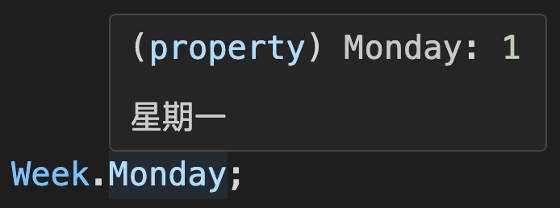

<!-- markdownlint-disable MD001 MD009 MD033 MD041 -->

[English](./README.md) | [中文](./README.zh-CN.md) | [CHANGELOG](./CHANGELOG.md)

<p align="center">
  <a href="https://github.com/shijistar/enum-plus" target="blank">
    
  </a>
</p>

<p align="center">
  <strong>像原生 enum 一样，但更强大！</strong>
</p>
<br/>

[](https://www.npmjs.com/package/enum-plus)
[](https://www.npmjs.com/package/enum-plus?activeTab=code)
[](https://www.npmjs.com/package/enum-plus)
[](https://codecov.io/gh/shijistar/enum-plus)


**支持平台**

[](https://github.com/shijistar/enum-plus)
[![Web Browsers](https://img.shields.io/badge/Web%20Browser-2185D0?logo=data:image/png;base64,iVBORw0KGgoAAAANSUhEUgAAABgAAAAYCAMAAADXqc3KAAABa1BMVEUAAAD/1kZap04co1BLr1H/1kZKr0//zDbmXC6IzZv95Y390jpLr09Lr0//1kT/1kU8rE/aeibNi13NfUz3kUrDjVrZaTjZWib2YSn2YSj3iC33xRp7q1/91kX9211cuWxBsWv81VL/10f1jhX411Uqpk771Ub2byLNazVTq0xAq09Lr0/91EBAqk6SwFkipFD8zi/GZiz1dSHGYCb2dSDKykirw0oup0/6yiO2dzn2fhuzdDVKrlD1fxv1gBtHrU+hcCr4wRT3Vi1Lr1D/1kVHr1D+1T//10b3Uyr3TyUel+wWj+f2hhn6yiT3SR74wxOn2PmdzfINh+FErVA8rFAxqFD90Tf8zjD2Ow3j8/7g7/sinO8Zk+kRi+QIgt73RBin1fYto/EMgt3J58z88MLYvJxBrVA5qlAqplAkpFD0WC33QBOu3Pvf7vre7vqgzfG748v97rtRqk1knUSBiDembSftUiTFWBrhRxFiNA5aAAAAQnRSTlMAUQX89dtVBfv6+fHapqSJUQ39/f38/Pz7+/j48/Py8fHx7+7s6+fj4t7d3NjX1dXRz8/OzsHApqWTk46MiomAfUvELz/2AAABGUlEQVQoz52P11rCQBBGQ4mhKIK999577ytKEo2JgiaxgAIWsPfHd3Z2JXDLuTzn+ydZoWwiy0O+XK55cCVS6ld9sR1G03qRdk/LcgwKY8YJs5qGgTP377fMpCYXlw1+aPg3T0tDTV3LAdIrYaggn2Ze+85aum69tR5RtjFUEfJjJrOP1+eKksocUpYwVBLyYTZa4C9U1e4+A6YweAkhX7U69ZfHRuAUCBbCe72O/soI7AFBfgposxXqb547aBjjH6ekUyr4l8wuJcR/F4h607ZhPL32YXCxB46Cj57cdvr9XRPoRUlgEwzxu8SDZ4APOGt0EE/cexbQVwsFNtmgv30fAO8QHqGDedAi3nFwhxcnx3vEkEsSyuUPnANWVoDZ/WEAAAAASUVORK5CYII=)](https://www.npmjs.com/package/enum-plus)
[](https://reactnative.dev)
[](https://developers.weixin.qq.com/miniprogram/dev/framework)
[![Taro](https://img.shields.io/badge/Taro-18BCF2?logo=data:image/png;base64,iVBORw0KGgoAAAANSUhEUgAAACkAAAAcCAMAAADLCWbaAAABSlBMVEUAAAAAL7MAJ7QAKrcAJ7NxyP90zP8Pev8Tfv8Tff8Uff8Rff9zyv8Tgv8AT9hzy/8Uf/9zyv8Uff8TfP8AJ7Ryyv8AJ7UVff8AJ7IUfv8Tfv8AJrVzyf8Sff8Te/8Vfv8DKbsTev8Mef8Maextv/8AM60AKLZ1zP8Vfv8AKbQAJ7Rvxv8AKLRuxP8AJ7R0y/8MXuIFQ8tzy/8AKLR0y/8BLbkUfv8AJ7Ryyf90yf9Hpv9zyf8Vff8AJrQPbPFyyv9zyv9zy/8AJ7RGo/8Sfv8AKbFivv8Se/9wzP8AI65t2/8Ufv8AKLR0yv8AKbgWg/93zv92zf91y/8WhP8Xgf9ivP8ojv8UgP8AJrMWhf8FP8hMrP8UffwJUtoDNsEBLrx30P9txP9kvv9atf9Tr/89nv8qjv8kiv8Whv8Sd/gRbvEOZegMXOIIStE2vhD3AAAAS3RSTlMACeQkszTNDH24nYFbFgTv7uTb1dXMmF9UTUVDPTcvKSkiHhMODPr59vXx7uzd3djSysPBwL28t66rpqCTk4SCfHZwZlU+Jx0ZFgduc4qrAAABVElEQVQ4y42QV1PCQBCAo4ihF+m923vvvQu5BIIxIGDv/v9Xb+9B9jJzjt/j3jf37awkxhOs1/osstmAhYoPpstqDbEPo5PwIM90nE7Tc5xphx+XlCqHMpGi4wM/jgclysVo1WKGbXS8oSGzvgVmXLGYvZWSLJ9GcFzzUNEX5U2l1Zl3uN2bUxoyx85hzVlOvGm9E9IgRruG4xGI5y3xb3IFPGo4vgfmIf9l70sH8aWJTTUN5hpvdj+Y+XyP4/4yFSuTljVvWfxJ1QCVcbd+Sc2U5ZYdtqbefmgCM8MMD8R3FI7up87M12vGkZ1RBjM6xLFA478YoaLUx8aR320gk2yXJBFeF0GmeSwJyY4YyAxkxWaCizvPhKLsxqbpkIVmYRWvqSfF8cw4FkM5oeiLmXhNl/efN3qLieM5fCMjkBGbSf5GBfGNHNhs/HGjopPgPxP86w8TLLu5GsqeugAAAABJRU5ErkJggg==)](https://taro.zone/)

⬇️ &nbsp;[简介](#简介) | [特性](#特性) | [安装](#安装) | [枚举定义](#枚举定义) | [API](#api) | [静态方法](#静态方法) | [使用案例](#使用案例) | [插件系统](#插件系统) | [本地化](#本地化) | [全局扩展](#全局扩展) | [命名冲突](#命名冲突) | [最佳实践](#最佳实践)| [兼容性](#兼容性) | [常见问题](#常见问题) | [贡献](#贡献)&nbsp; ⬇️

> **🎉 v3.0 发布了！**
>
> 新版本是一个重大的里程碑版本，带来了很多令人兴奋的功能和改进，详情请参考 [发布说明](./docs/release-v3.zh-CN.md) 和 [迁移指南](./docs/migration-guide-v2-to-v3.zh-CN.md)。

## 简介

`enum-plus`是一个增强版的枚举类库，完全兼容原生`enum`的用法，是原生`enum`的直接替代品。支持为枚举项增加显示文本，以及扩展自定义元数据，可以作为一个静态配置系统。文本支持国际化，可以把数值转换为当前语言的显示文本，在UI回显业务数据时非常有帮助。枚举可以生成下拉框等各种UI组件，对于前端开发来说非常实用。类库还提供了丰富的扩展方法，支持对枚举项数组的遍历和数据转换。这是一个轻量级、零依赖、100% TypeScript 实现的工具，适用于多种前端框架。

还有哪些令人兴奋的特性呢？请继续探索吧！或者不妨先看下这个使用视频。

<p align="center">
   
</p>

## 特性

- 完全兼容原生 `enum` 的用法
- 支持`number`、`string`等多种数据类型
- 枚举项支持设置显示文本
- 文本支持国际化，可与任何 i18n 库集成
- 快速将值转换为显示文本，在UI回显时非常有用
- 枚举项支持扩展元数据字段，可以作为静态配置系统使用
- 支持插件体系，可以通过安装插件扩展枚举功能
- 支持数据类型约束，提高代码的类型安全性<sup>_&nbsp;&nbsp;TypeScript_</sup>
- 枚举可以生成下拉框等UI组件，支持 [AntDesign](https://ant-design.antgroup.com/components/overview-cn)、[ElementPlus](https://element-plus.org/zh-CN/component/select.html)、[Material-UI](https://mui.com/material-ui) 等多种组件库
- 支持服务端渲染(SSR)
- 支持 Web浏览器、Node.js、ReactNative、Taro、小程序等多种环境
- 兼容任何前端开发框架，支持无框架的纯原生项目
- 面向TypeScript设计，具有良好的类型推导和代码补全能力
- 零依赖项
- 轻量（gzip压缩后仅 2KB+）

## 安装

使用 npm 安装:

```bash
npm install enum-plus
```

使用 pnpm 安装:

```bash
pnpm add enum-plus
```

使用 bun 安装:

```bash
bun add enum-plus
```

或者使用 yarn:

```bash
yarn add enum-plus
```

**免安装**:

- 特定版本号:

```html
<!-- 兼容 ES2020 的现代版本 -->
<script src="https://cdn.jsdelivr.net/npm/enum-plus@v3.0.0/umd/enum-plus.min.js"></script>
<!-- 兼容 ES2015 的早期版本 -->
<script src="https://cdn.jsdelivr.net/npm/enum-plus@v3.0.0/umd/enum-plus-legacy.min.js"></script>
```

- 最新版本:

```html
<!-- 兼容 ES2020 的现代版本 -->
<script src="https://cdn.jsdelivr.net/npm/enum-plus/umd/enum-plus.min.js"></script>
<!-- 兼容 ES2015 的早期版本 -->
<script src="https://cdn.jsdelivr.net/npm/enum-plus/umd/enum-plus-legacy.min.js"></script>
```

⬇️ **下载文件**:

- [enum-plus.umd.min.js.gz](https://github.com/shijistar/enum-plus/releases/download/v3.0.0/enum-plus.umd.min.js.gz)
- [enum-plus.umd.tar.gz](https://github.com/shijistar/enum-plus/releases/download/v3.0.0/enum-plus.umd.tar.gz) (含 sourcemap)
- [enum-plus-legacy.umd.min.js.gz](https://github.com/shijistar/enum-plus/releases/download/v3.0.0/enum-plus-legacy.umd.min.js.gz)
- [enum-plus-legacy.umd.tar.gz](https://github.com/shijistar/enum-plus/releases/download/v3.0.0/enum-plus-legacy.umd.tar.gz) (含 sourcemap)

> 你也可以从 [Github发布](https://github.com/shijistar/enum-plus/releases/tag/v3.0.0) 下载这些文件

## 枚举定义

本节展示了使用 `Enum` 函数初始化枚举的多种方式，你可以根据不同的使用场景选择最合适的方法

### 1. Key-Value 格式

```js
import { Enum } from 'enum-plus';

// Number 类型
const WeekEnum = Enum({
  Sunday: 0,
  Monday: 1,
});

WeekEnum.Monday; // 1

// String 类型
const WeekEnum2 = Enum({
  Sunday: 'Sun',
  Monday: 'Mon',
});

WeekEnum2.Monday; // 'Mon'
```

### 2. 标准格式（推荐）

为每个枚举项指定 `value` (枚举值) 和 `label`（显示文本）字段，这是最常用的格式，也是推荐的格式。这种格式允许你为每个枚举项设置显示文本，这些文本可以在UI组件中使用。关于为 `label` 字段启用本地化支持，请参考[本地化](#本地化)章节

```js
import { Enum } from 'enum-plus';

const WeekEnum = Enum({
  Sunday: { value: 0, label: '星期日' },
  Monday: { value: 1, label: '星期一' },
});

WeekEnum.Sunday; // 0
WeekEnum.label(0); // 星期日
```

### 3. Key-Label 格式

当你希望使用`key`作为枚举值时，这种方式比较有用，此时`value`和`key`的值相同，`label`是显示文本

```js
import { Enum } from 'enum-plus';

const WeekEnum = Enum({
  Sunday: { label: '星期日' },
  Monday: { label: '星期一' },
});

WeekEnum.Sunday; // 'Sunday'
WeekEnum.label('Sunday'); // 星期日
```

### 4. 数组格式

数组格式在需要动态创建枚举时很有用，例如从 API 获取数据中动态创建一个枚举。这种方式还允许[自定义字段映射](#数组格式初始化设置不同的字段映射)，这增加了灵活性，可以适配不同的数据格式

```js
import { Enum } from 'enum-plus';

const pets = [
  { value: 1, key: 'Dog', label: '狗' },
  { value: 2, key: 'Cat', label: '猫' },
  { value: 3, key: 'Rabbit', label: '兔子' },
];
const PetEnum = Enum(pets);

PetEnum.Dog; // 1
PetEnum.label(1); // 狗
```

### 5. 原生枚举格式

如果你已经有一个原生的枚举，你可以直接传递给`Enum`函数，它会自动转换为增强版的枚举，这样可以借用原生枚举的`枚举值自动递增`特性

```ts
import { Enum } from 'enum-plus';

enum init {
  Sunday = 0,
  Monday,
  Tuesday,
  Wednesday,
  Thursday,
  Friday,
  Saturday,
}
const WeekEnum = Enum(init);

WeekEnum.Sunday; // 0
WeekEnum.Monday; // 1
WeekEnum.Saturday; // 6
```

## API

### 💎 &nbsp; 拾取枚举值

`Enum.XXX`

像原生`enum`一样，直接拾取一个枚举值

```js
WeekEnum.Sunday; // 0
WeekEnum.Monday; // 1
```

---

### 💎 &nbsp; named

`Record<string, EnumItemClass>`

一个聚合了所有枚举项的只读对象，可以通过`key`来快速访问某个枚举项对象。

```js
WeekEnum.named.Monday; // { key: 'Monday', value: 1, label: '星期一' }
```

### 💎 &nbsp; items

`{ value, label, key, raw }[]`

获取一个包含全部枚举项的只读数组，可以方便地遍历枚举项。

```js
WeekEnum.items; // [ { value: 0, label: '星期日', key: 'Sunday' }, { value: 1, label: '星期一', key: 'Monday' }, ... ]
```

---

### 💎 &nbsp; values

`(string | number)[]`

获取一个包含全部枚举项`value`的数组

```js
WeekEnum.values; // [0, 1, 2, 3, 4, 5, 6]
```

---

### 💎 &nbsp; labels

`string[]`

获取一个包含全部枚举项`label`的数组

```js
WeekEnum.labels; // ['星期日', '星期一', ... '星期五', '星期六']
```

---

### 💎 &nbsp; keys

`string[]`

获取一个包含全部枚举项`key`的数组

```js
WeekEnum.keys; // ['Sunday', 'Monday', ... 'Friday', 'Saturday']
```

---

### 💎 &nbsp; meta

`Record<string, any[]>`

获取一个包含全部枚举项自定义字段的聚合对象，键是字段名，值是该字段的所有枚举项值的数组，这样可以在不遍历枚举项的情况下访问自定义字段。

```js
const ColorEnum = Enum({
  Red: { value: 1, label: 'Red', hex: '#FF0000' },
  Green: { value: 2, label: 'Green', hex: '#00FF00' },
  Blue: { value: 3, label: 'Blue', hex: '#0000FF' },
});
ColorEnum.meta.hex; // ['#FF0000', '#00FF00', '#0000FF']
```

顺便一提，可以通过`named`属性快速访问单个枚举项的自定义字段

```js
ColorEnum.named.Red.raw.hex; // '#FF0000'
```

### 💎 &nbsp; has

<sup>**_\[方法]_**</sup> &nbsp; `has(keyOrValue?: string | number): boolean`

判断某个枚举项（值或 key）是否存在

```js
WeekEnum.has(1); // true
WeekEnum.has('Sunday'); // true
WeekEnum.has(9); // false
WeekEnum.has('Birthday'); // false
```

---

### 💎 &nbsp; findBy

<sup>**_\[方法]_**</sup> &nbsp; `findBy(field: string, value: any): EnumItemClass | undefined`

根据指定字段和字段值，获取枚举项对象，如果不存在则返回`undefined`

字段名支持：`key`、`value`、`label`或元数据字段

```js
WeekEnum.findBy('value', 1); // { key: 'Monday', value: 1, label: '星期一' }
WeekEnum.findBy('key', 'Monday'); // { key: 'Monday', value: 1, label: '星期一' }
```

---

### 💎 &nbsp; label

<sup>**_\[方法]_**</sup> &nbsp; `label(keyOrValue?: string | number): string | undefined`

根据某个枚举值或枚举 key，获取该枚举项的显示文本。如果设置了本地化，则会返回本地化后的文本。

```js
WeekEnum.label(1); // 星期一
WeekEnum.label('Monday'); // 星期一
```

---

### 💎 &nbsp; key

<sup>**_\[方法]_**</sup> &nbsp; `key(value?: string | number): string | undefined`

根据枚举值获取该枚举项的 key，如果不存在则返回`undefined`

```js
WeekEnum.key(1); // 'Monday'
```

---

### 💎 &nbsp; raw

<sup>**_\[方法^1]_**</sup> &nbsp; `raw(): Record<K, T[K]>`
<br/>
<sup>**_\[方法^2]_**</sup> &nbsp; `raw(keyOrValue: V | K): T[K]`

第一个重载方法，返回枚举集合的初始化对象，即用来初始化 Enum 原始 init 对象。

第二个重载方法，用来处理单个枚举项，根据获取单个枚举项的原始初始化对象。

这个方法主要作用是，用来获取枚举项的自定义字段，支持无限扩展字段

```js
const WeekEnum = Enum({
  Sunday: { value: 0, label: '星期日', happy: true },
  Monday: { value: 1, label: '星期一', happy: false },
});

WeekEnum.raw(0).happy; // true
WeekEnum.raw(0); // { value: 0, label: '星期日', happy: true }
WeekEnum.raw('Monday'); // { value: 1, label: '星期一', happy: false }
WeekEnum.raw(); // { Sunday: { value: 0, label: '星期日', happy: true }, Monday: { value: 1, label: '星期一', happy: false } }
```

> 如果要获取已知枚举项的自定义字段，推荐使用`named`属性来访问

---

### 💎 &nbsp; toList

<sup>**_\[方法^1]_**</sup> &nbsp; `toList(): { value, label }[]`
<br/>
<sup>**_\[方法^2]_**</sup> &nbsp; `toList(options?: { valueField?: string; labelField?: string }): { [key: string]: any }[]`

将枚举转换为一个默认包含`value`和`label`字段的数组，或者通过`options`参数自定义字段名。

```js
WeekEnum.toList();
// [
//   { value: 1, label: '星期一' },
//   { value: 2, label: '星期二' },
//   ...
// ]
WeekEnum.toList({ valueField: 'id', labelField: 'name' });
// [
//   { id: 1, name: '星期一' },
//   { id: 2, name: '星期二' },
//   ...
// ]
```

---

### 💎 &nbsp; toMap

<sup>**_\[方法^1]_**</sup> &nbsp; `toMap(): Record<string, string | number>`
<br/>
<sup>**_\[方法^2]_**</sup> &nbsp; `toMap(options?: { keySelector?: string; valueSelector?: string }): Record<string, any>`

将枚举转换为一个默认以`value`为键，`label`为值的对象，或者通过`options`参数自定义键和值的字段名。

```js
WeekEnum.toMap();
// {
//   "1": '星期一',
//   "2": '星期二',
//   ...
// }
WeekEnum.toMap({ keySelector: 'key', valueSelector: 'value' });
// {
//   "Monday": 1,
//   "Tuesday": 2,
//   ...
// }
```

---

### 💎 &nbsp; name

`string`

枚举类型的显示名称。在创建枚举时，可以通过传入一个可选的 `name` 参数来为枚举类型命名。这个名称可以是一个普通字符串，也可以是一个本地化键值，以支持国际化文本。关于本地化的更多信息，请参考[本地化](#本地化)章节。

> 在UI组件中，枚举通常用来作为数据源，生成下拉框表单项，或在表格单元格中显式枚举成员文本。而对应的表单项标签或列标题就是枚举类型的名称。通过使用`name`，我们可以集中管理枚举名称，和枚举成员的名称，也更方便使用。

```js
const WeekEnum = Enum(
  {
    Sunday: { value: 0, label: '星期日', happy: true },
    Monday: { value: 1, label: '星期一', happy: false },
  },
  {
    name: 'i18n.enums.week', // 可以是一个本地化键值
  }
);

WeekEnum.name; // 周
WeekEnum.label(0); // 星期日
WeekEnum.label(1); // 星期一
```

---

### ⚡️ &nbsp; valueType &nbsp;&nbsp;&nbsp; <sup>**_\[TypeScript ONLY]_**</sup>

`value1 | value2 | ...`

在 TypeScript 中，提供了一个包含所有枚举值的联合类型，用于缩小变量或组件属性的数据类型。这种类型替代了像 `number` 或 `string` 这样宽泛的原始类型，使用精确的值集合，防止无效赋值，同时提高代码可读性和编译时类型安全性。

```typescript
type WeekValues = typeof WeekEnum.valueType; // 0 | 1

const weekValue: typeof WeekEnum.valueType = 1; // ✅ 类型正确，1 是一个有效的周枚举值
const weeks: (typeof WeekEnum.valueType)[] = [0, 1]; // ✅ 类型正确，0 和 1 是有效的周枚举值
const badWeekValue: typeof WeekEnum.valueType = 8; // ❌ 类型错误，8 不是一个有效的周枚举值
const badWeeks: (typeof WeekEnum.valueType)[] = [0, 8]; // ❌ 类型错误，8 不是一个有效的周枚举值
```

> 注意，这只是一个 TypeScript 类型，只能用来约束类型。不可在运行时调用，运行时调用会抛出异常。

---

### ⚡️ &nbsp; keyType &nbsp;&nbsp;&nbsp; <sup>**_\[TypeScript ONLY]_**</sup>

`key1 | key2 | ...`

与`valueType`类似，获取一个包含全部枚举 `key` 的联合类型

```typescript
type WeekKeys = typeof WeekEnum.keyType; // 'Sunday' | 'Monday'
const weekKey: typeof WeekEnum.keyType = 'Monday';
const weekKeys: (typeof WeekEnum.keyType)[] = ['Sunday', 'Monday'];
```

> 注意，这只是一个 TypeScript 类型，只能用来约束类型。不可在运行时调用，运行时调用会抛出异常。

---

### ⚡️ &nbsp; rawType &nbsp;&nbsp;&nbsp; <sup>**_\[TypeScript ONLY]_**</sup>

`{ value: V, label: string, [...] }`

获取初始化整个枚举集合的原始类型，即用来创建枚举集合的对象。

与无参数的`raw`方法类似，只不过`raw`是一个运行时方法，而`rawType`是一个约束类型

```typescript
type WeekRaw = typeof WeekEnum.rawType;
// { Sunday: { value: 0, label: string }, Monday: { value: 1, label: string } }
```

> 注意，这只是一个 TypeScript 类型，只能用来约束类型。不可在运行时调用，运行时调用会抛出异常。

---

## 静态方法

### 💎 &nbsp; Enum.isEnum

<sup>**_\[方法]_**</sup> &nbsp; `isEnum(obj: any): boolean`

判断一个对象是否是一个由`Enum`函数创建的枚举对象

```js
Enum.isEnum(WeekEnum); // true
Enum.isEnum({}); // false
```

---

### 💎 &nbsp; Enum.localize

<sup>**_\[方法]_**</sup> &nbsp; `(key: string) => string`

设置全局的本地化函数，用来处理枚举类型名称和枚举项显示文本的本地化，更多信息请参考[本地化](#本地化)章节。

```js
import i18n from 'i18next';

Enum.localize = (key) => i18n.t(key);
```

---

### 💎 &nbsp; Enum.extends

<sup>**_\[方法]_**</sup> &nbsp; `(obj: Record<string, unknown> | undefined) => void`

为所有枚举对象添加全局扩展方法，更多信息请参考[全局扩展](#全局扩展)章节。

```js
Enum.extends({
  sayHello() {
    return `你好，EnumPlus!`;
  },
});
```

---

### 💎 &nbsp; Enum.install

<sup>**_\[方法]_**</sup> &nbsp; `(plugin: Plugin, options?: any) => void`

安装一个插件，插件可以为所有枚举添加新的功能。更多信息请参考[插件系统](#插件系统)章节。

```js
import i18nextPlugin from '@enum-plus/plugin-i18next';

Enum.install(i18nextPlugin);
```

## 使用案例

#### 💡 基础用法，替代魔法数字

```js
const WeekEnum = Enum({
  Sunday: { value: 0, label: '星期日' },
  Monday: { value: 1, label: '星期一' },
});

if (today === WeekEnum.Sunday) {
  // 今天是星期天，享受你的一天吧！
} else if (today === WeekEnum.Monday) {
  // 哦不，又是星期一了...
}
```

---

#### 💡 检查是否一个有效的枚举值

```js
if (WeekEnum.has(value)) {
  // 是一个有效的枚举值，可以安全使用
} else {
  // 抛出异常或使用默认值
}
```

---

#### 💡 检查是否一个枚举对象

```js
let values: number[] | undefined;
if (Enum.isEnum(data)) {
  values = data.values;
} else if (Array.isArray(data)) {
  values = data;
} else {
  // 非法输入，抛出异常或使用默认值
}
```

---

#### 💡 生成 UI 组件

以 React + Ant Design 为例，更多UI组件的案例请参考 [支持多种前端框架](#-支持多种前端框架) 章节

```jsx
import { Menu, Select, Table } from 'antd';
import { ProFormCheckbox, ProFormSelect } from '@ant-design/pro-components';

const App = () => {
  return (
    <>
      <Select options={WeekEnum.items} />
      <Menu items={WeekEnum.toMenu()} />
      <Table columns={[{ filters: WeekEnum.toFilter() }]} />
      <ProFormSelect valueEnum={WeekEnum.toValueMap()} />
      <ProFormCheckbox valueEnum={WeekEnum.toValueMap()} />
    </>
  );
};
```

> 需要安装 [@enum-plus/plugin-antd](https://github.com/shijistar/enum-plus/tree/main/packages/plugin-antd) 插件

---

#### 💡 支持本地化显示文本

可以支持多语言环境，将`label`字段设置为一个本地化键值，根据当前语言环境显示对应的文本。更多信息请参考 [本地化](#本地化) 章节。

```js
WeekEnum.label(1); // Monday 或 星期一，取决于当前语言环境
WeekEnum.named.Monday.label; // Monday 或 星期一，取决于当前语言环境
WeekEnum.name; // Week 或 周，取决于当前语言环境
```

---

#### 约束数据类型 (仅TypeScript)

```ts
type MyComponentProps = {
  day: typeof WeekEnum.valueType; // 0 | 1 | ... | 5 | 6
};
const MyComponent = (props: MyComponentProps) => {
  return <div>今天是 {WeekEnum.label(props.day)}</div>;
};

<MyComponent day={1} />; // ✅ 类型正确
<MyComponent day="Monday" />; // ❌ 类型错误
<MyComponent day={8} />; // ❌ 错误，8 不是一个有效的枚举值
```

```ts
function setDay(day: typeof WeekEnum.valueType) {
  // day 的类型被约束为 0 | 1 | ... | 5 | 6
}

setDay(1); // ✅ 类型正确
setDay('Monday'); // ❌ 类型错误
setDay(8); // ❌ 错误，8 不是一个有效的枚举值
```

---

#### 💡 添加元数据字段，可以作为静态全局配置系统使用

```js
const ColorEnum = Enum({
  Red: { value: 1, hex: '#FF0000', icon: '🔥' },
  Green: { value: 2, hex: '#00FF00', icon: '🍏' },
  Blue: { value: 3, hex: '#0000FF', icon: '🔵' },
});

ColorEnum.values; // [1, 2, 3]
ColorEnum.keys; // ['Red', 'Green', 'Blue']
ColorEnum.meta.hex; // ['#FF0000', '#00FF00', '#0000FF']
ColorEnum.meta.icon; // ['🔥', '🍏', '🔵']
ColorEnum.named.Red.raw.hex; // '#FF0000'
ColorEnum.named.Red.raw.icon; // '🔥'
```

---

#### 支持遍历枚举项数组，但不可修改

```js
Array.isArray(WeekEnum.items); // true
WeekEnum.items.map((item) => item.value); // [0, 1, ..., 5, 6]
WeekEnum.items.forEach((item) => {
  // ✅ 可遍历
});
for (const item of WeekEnum.items) {
  // ✅ 可遍历
}

WeekEnum.items.push({ value: 2, label: '星期二' }); // ❌ 不可修改
WeekEnum.items.splice(0, 1); // ❌ 不可修改
WeekEnum.items[0].label = 'foo'; // ❌ 不可修改
```

---

#### 💡 枚举组合（合并）

```js
const PrimaryColorEnum = Enum({
  Red: { value: 1, hex: '#FF0000' },
  Green: { value: 2, hex: '#00FF00' },
  Blue: { value: 3, hex: '#0000FF' },
});
const SecondaryColorEnum = Enum({
  Yellow: { value: 4, hex: '#FFFF00' },
  Cyan: { value: 5, hex: '#00FFFF' },
  Magenta: { value: 6, hex: '#FF00FF' },
});
const AllColorEnum = Enum({
  ...PrimaryColorEnum.raw(),
  ...SecondaryColorEnum.raw(),
});
```

---

#### 枚举项支持 Jsdoc 注释，启用代码智能提示

在代码编辑器中，将光标悬停在枚举项上，即可显示关于该枚举项的详细 Jsdoc 注释，而不必再转到枚举定义处查看。关于如何编写良好的代码，请参考 [最佳实践](./docs/best-practices.md) 章节。

```js
const WeekEnum = Enum({
  /** 星期日 */
  Sunday: { value: 0, label: '星期日' },
  /** 星期一 */
  Monday: { value: 1, label: '星期一' },
});

WeekEnum.Monday; // 将光标悬浮在 Monday 上
```



可以看到，不但提示了枚举项的释义，还有枚举项的值，无需跳转离开当前光标位置，在阅读代码时非常方便。

---

#### 💡 支持多种前端框架

`Enum.items` 可以直接作为组件的数据源（以 Select 组件为例）

- **React相关框架**

  [Ant Design](https://ant-design.antgroup.com/components/select-cn) | [Arco Design](https://arco.design/react/components/select)
  Select

  ```tsx
  import { Select } from 'antd';

  <Select options={WeekEnum.items} />;
  ```

  [Material-UI](https://mui.com/material-ui/react-select/) Select

  ```tsx
  import { MenuItem, Select } from '@mui/material';

  <Select>
    {WeekEnum.items.map((item) => (
      <MenuItem key={item.value} value={item.value}>
        {item.label}
      </MenuItem>
    ))}
  </Select>;
  ```

  [Kendo UI](https://www.telerik.com/kendo-react-ui/components/dropdowns/dropdownlist) Select

  ```tsx
  import { DropDownList } from '@progress/kendo-react-dropdowns';

  <DropDownList data={WeekEnum.items} textField="label" dataItemKey="value" />;
  ```

- **Vue相关框架**

  [ElementPlus](https://element-plus.org/zh-CN/component/select.html) Select

  ```html
  <el-select>
    <el-option v-for="item in WeekEnum.items" v-bind="item" />
  </el-select>
  ```

  [Ant Design Vue](https://antdv.com/components/select-cn) | [Arco Design](https://arco.design/vue/component/select) Select

  ```html
  <a-select :options="WeekEnum.items" />
  ```

  [Vuetify](https://vuetifyjs.com/zh-Hans/components/selects) Select

  ```html
  <v-select :items="WeekEnum.items" item-title="label" />
  ```

- **Angular相关框架**

  [Angular Material](https://material.angular.io/components/select/overview) Select

  ```jsx
  <mat-select>
    @for (item of WeekEnum.items; track item.value) {
      <mat-option [value]="item.value">{{ item.label }}</mat-option>
    }
  </mat-select>
  ```

  [NG-ZORRO](https://ng.ant.design/components/select/zh) Select

  ```jsx
  <nz-select>
    @for (item of WeekEnum.items; track item.value) {
      <nz-option [nzValue]="item.value">{{ item.label }}</nz-option>
    }
  </nz-select>
  ```

---

#### 数组格式初始化，设置不同的字段映射

在 [4. 数组格式](#4-数组格式) 章节中，介绍了可以通过后端动态数据来构建枚举，但是很可能动态数据的字段名并不是`value`、`label`、`key`，而是其它的字段名。这时你可以传入一个自定义选项，把这些映射到其它字段名上

```js
import { Enum } from 'enum-plus';

const data = await getPetsData();
// [   { id: 1, code: 'dog', name: '狗' },
//     { id: 2, code: 'cat', name: '猫' },
//     { id: 3, code: 'rabbit', name: '兔' }   ];
const PetTypesEnum = Enum(data, {
  getValue: 'id',
  getLabel: 'name',
  getKey: 'code', // getKey可选
});
PetTypesEnum.items; // 输出如下:
// [   { value: 1, label: '狗', key: 'dog' },
//     { value: 2, label: '猫', key: 'cat' },
//     { value: 3, label: '兔', key: 'rabbit' }   ]
```

在上面的例子中，`getValue`、`getLabel`、`getKey` 还可以是一个函数，用来处理更复杂的业务逻辑，比如：

```js
const PetTypeEnum = Enum(petTypes, {
  getValue: (item) => item.id,
  getLabel: (item) => `${item.name} (${item.code})`,
  getKey: (item) => item.code,
});
```

---

## 插件系统

`enum-plus` 提供了一个插件系统，允许你为枚举添加额外的功能。插件可以为所有枚举实例添加新的方法或属性，极大地扩展了枚举的功能。你可以选择性地安装需要的插件，而不是将所有功能都打包在一起，从而保持核心库的轻量和高效。

```ts
import antdPlugin from '@enum-plus/plugin-antd';
import { Enum } from 'enum-plus';

Enum.install(antdPlugin);
```

当你安装一个插件后，插件会为所有枚举实例添加新的方法或属性。例如，安装了 [@enum-plus/plugin-antd](https://github.com/shijistar/enum-plus/tree/main/packages/plugin-antd) 插件后，你可以使用 `enum.toSelect` 方法使用枚举生成一个 Select 组件。

你还可以设置插件的可选配置选项，以定制插件的行为，关于插件的配置选项，请参考各个插件的文档。

```ts
import antdPlugin from '@enum-plus/plugin-antd';
import { Enum } from 'enum-plus';

Enum.install(antdPlugin, {
  toSelect: {
    valueField: 'id', // 设置 toSelect 方法生成的数据对象中，关于值的字段名
    labelField: 'name', // 设置 toSelect 方法生成的数据对象中，关于显示文本的字段名
  },
});
```

### 插件生态

目前我们已经开发并发布了以下插件，你可以根据需要选择安装：

- [@enum-plus/plugin-antd](https://github.com/shijistar/enum-plus/tree/main/packages/plugin-antd): Ant Design 相关功能，包括 `enum.toSelect`、`enum.toMenu`、`enum.toFilter` 和 `enum.toValueMap`。通过这些方法，可以直接将枚举绑定到对应的 Ant Design 组件上，极大地简化了代码。
- [@enum-plus/plugin-i18next](https://github.com/shijistar/enum-plus/tree/main/packages/plugin-i18next): 自动适配 [i18next](https://www.i18next.com) 以让枚举支持国际化。
- [@enum-plus/plugin-react-i18next](https://github.com/shijistar/enum-plus/tree/main/packages/plugin-react-i18next): 自动适配 [react-i18next](https://react.i18next.com) 以让枚举支持国际化。
- [@enum-plus/plugin-react](https://github.com/shijistar/enum-plus/tree/main/packages/plugin-react): React 集成，包括支持 `Enum.localize` 返回 React 组件，以及监听语言变化以自动重新渲染组件。
- 我们正在开发以下插件：
  - [@enum-plus/plugin-vue](https://github.com/shijistar/enum-plus/tree/main/packages/plugin-vue): Vue 集成，包括支持 `Enum.localize` 返回 Vue 组件，以及监听语言变化以自动重新渲染组件。
  - [@enum-plus/plugin-angular](https://github.com/shijistar/enum-plus/tree/main/packages/plugin-angular): Angular 集成，包括支持 `Enum.localize` 返回 Angular 组件，以及监听语言变化以自动重新渲染组件。_我们需要你的帮助来开发这个插件！_

> 如果你没有找到需要的插件，或者你想开发自己的插件，请参阅 [插件开发指南](./docs/plugin-development.zh-CN.md)。你可以在enum-plus官方仓库中开发新插件，也可以将你开发的插件发布到 npm 上，并把你的插件链接分享在这里。我们真诚地需要你的帮助，来丰富插件生态系统！

---

## 本地化

enum-plus 默认不内置国际化能力，因此枚举项的`label`字段将被视为普通字符串，直接返回原始文本。

为 enum-plus 添加本地化支持，最简单的方式是安装对应的 [i18n插件](#插件生态)，例如 `@enum-plus/plugin-i18next`，它会自动将 `label` 和 `name` 字段的值传递给 i18next 进行翻译。

```bash
npm install @enum-plus/plugin-i18next i18next
```

然后在项目入口文件中安装插件：

_index.js_

```js
import i18nextPlugin from '@enum-plus/plugin-i18next';
import { Enum } from 'enum-plus';

Enum.install(i18nextPlugin);
```

安装了插件后，枚举的 `label` 和 `name` 字段将自动通过 i18next 进行翻译。

```js
const WeekEnum = Enum(
  {
    Sunday: { value: 0, label: 'week.sunday' },
    Monday: { value: 1, label: 'week.monday' },
  },
  { name: 'weekDays.name' }
);
WeekEnum.label(1); // Monday 或 星期一，取决于当前语言环境
WeekEnum.named.Monday.label; // Monday 或 星期一，取决于当前语言环境
WeekEnum.name; // Week 或 周，取决于当前语言环境
```

此插件还支持自定义 i18next 选项，甚至允许完全控制 localize 方法，更多信息请参考[插件文档](https://github.com/shijistar/enum-plus/tree/main/packages/plugin-i18next/README.zh-CN.md#插件选项)。

如果你需要切换语言后自动更新UI，这需要借助 React、Vue 或 Angular 等框架的能力，请考虑使用 [@enum-plus/plugin-react](https://github.com/shijistar/enum-plus/tree/main/packages/plugin-react) 或 [@enum-plus/plugin-vue](https://github.com/shijistar/enum-plus/tree/main/packages/plugin-vue) 等插件。

如果你使用的是其它国际化库，例如 `react-intl`、`vue-i18next` 或 `ngx-translate`，你可以通过 `Enum.localize` 方法来集成这些库。

_my-extension.js_

```js
import { Enum } from 'enum-plus';

Enum.localize = (key) => {
  // 这是一段伪代码，请根据你使用的国际化库进行调整
  return intl.formatMessage({ id: key });
};
```

> 一旦你完成了这项功能，建议你考虑把它发布成一个 npm 包，并分享在[插件生态](#插件生态)章节中，这样其他人也可以受益于你的工作。如果你觉得这个项目非常通用，也可以考虑把它提交到 [enum-plus](https://github.com/shijistar/enum-plus/tree/main/packages) 官方插件库中，具体开发规则请参阅 [插件开发指南](./docs/plugin-development.zh-CN.md)。

---

## 全局扩展

Enum 提供了丰富的内置方法和属性，它们已经可以满足大多数常见的使用场景。如果这些还不够，你还可以使用 `Enum.extends` 扩展更多的自定义方法。这些扩展会全局应用于所有枚举实例，包括在扩展应用之前创建的实例，并且会立即生效，无需任何额外的设置。

> 实际上，整个[插件系统](#插件系统)以及 `Enum.install` 在底层都是通过 `Enum.extends` 来实现的。

- **TypeScript 项目**

  _my-enum-extension.ts_

  ```ts
  // 功能实现
  Enum.extends({
    toMySelect() {
      return this.items.map((item) => ({ value: item.value, title: item.label }));
    },
    reversedItems() {
      return this.items.reverse();
    },
  });

  // 类型声明，以获得更好的类型提示
  declare module 'enum-plus/extension' {
    export interface EnumExtension<T, K, V> {
      toMySelect: () => { value: V; title: string }[];
      reversedItems: () => EnumItemClass<EnumItemInit<V>, K, V>[];
    }
  }
  ```

  _index.ts_

  然后在项目的入口文件中导入这个文件：

  ```ts
  import './my-enum-extension';

  WeekEnum.toMySelect(); // [{ value: 0, title: '星期日' }, { value: 1, title: '星期一' }]
  ```

- **JavaScript 项目**

  _my-enum-extension.js_

  ```js
  import { Enum } from 'enum-plus';

  Enum.extends({
    toMySelect() {
      return this.items.map((item) => ({ value: item.value, title: item.label }));
    },
    reversedItems() {
      return this.items.reverse();
    },
  });
  ```

  _my-enum-extension.js.d.ts_

  ```ts
  import { EnumExtension, EnumItemClass, EnumItemInit } from 'enum-plus';

  declare module 'enum-plus/extension' {
    export interface EnumExtension<T, K, V> {
      toMySelect: () => { value: V; title: string }[];
      reversedItems: () => EnumItemClass<EnumItemInit<V>, K, V>[];
    }
  }
  ```

  _index.js_

  然后在项目的入口文件中导入这个文件：

  ```js
  import './my-enum-extension';

  WeekEnum.toMySelect(); // [{ value: 0, title: '星期日' }, { value: 1, title: '星期一' }]
  ```

注意，`EnumExtension` 是一个泛型接口，它接受三个类型参数，它们的含义分别是：

- `T`: 表示枚举类型的初始化对象
- `K`: 表示枚举项的键值
- `V`: 表示枚举项的值

> 如果你希望在扩展方法中提供更友好的类型提示，你可能需要使用到这些类型参数。当然，这些类型参数是可选的，如果你不需要，可以直接忽略掉它们。

---

## 命名冲突？

`enum-plus` 设计时充分考虑了命名冲突的可能性。枚举项的命名空间与枚举实例的方法和属性是分开的，这样可以最大限度地减少冲突的可能性。例如，当枚举项的名称与某个方法名称相同时，你可以通过 `items` 属性访问那些被覆盖的方法。

```js
import { KEYS, VALUES } from 'enum-plus';

const WeekEnum = Enum({
  foo: { value: 1 },
  bar: { value: 2 },
  keys: { value: 3 }, // 命名冲突
  values: { value: 4 }, // 命名冲突
  label: { value: 5 }, // 命名冲突
  named: { value: 6 }, // 命名冲突
  toList: { value: 7 }, // 命名冲突
});

WeekEnum.foo; // 1
WeekEnum.bar; // 2
// 以下均为枚举项，优先级更高，会覆盖掉原来的方法
WeekEnum.keys; // 3
WeekEnum.values; // 4
WeekEnum.label; // 5
WeekEnum.named; // 6
WeekEnum.toList; // 7

// 可以 .items 访问到这些被覆盖的方法 🙂
WeekEnum.items[KEYS]; // ['foo', 'bar', 'keys', 'values', 'label', 'named', 'toList']
WeekEnum.items[VALUES]; // [1, 2, 3, 4, 5, 6, 7]
WeekEnum.items.label(1); // 'foo'
WeekEnum.items.named.foo; // { value: 1, label: 'foo', key: 'foo' }
WeekEnum.items.toList(); // [{ value: 1, label: 'foo' }, ...]
```

> 请注意，`keys` 和 `values` 这两个属性比较特殊，因为它们是 JavaScript 数组的内置方法，为了避免改变 items 数组的行为，需要使用 `KEYS` 和 `VALUES` 两个符号作为别名来访问它们。

再极端一点，万一 `items` 与枚举项命名冲突怎么办？放心，你仍然可以通过 `ITEMS` 别名来访问它。

```js
import { ITEMS } from 'enum-plus';

const WeekEnum = Enum({
  foo: { value: 1 },
  bar: { value: 2 },
  items: { value: 3 }, // 命名冲突
  toList: { value: 4 }, // 命名冲突
});

WeekEnum.items; // 3，枚举项优先级更高，会覆盖掉 items
WeekEnum[ITEMS].toList(); // 但可以通过 ITEMS 别名来访问它
```

---

## 最佳实践

在使用 `enum-plus` 创建和管理枚举时，遵循一些最佳实践可以帮助你编写更清晰、可维护的代码。以下是一些建议：

1. **枚举类型命名：** 采用 `PascalCase` 大驼峰命名法，并以 `Enum` 作为后缀，如 _WeekEnum_、_ColorEnum_ 等。
2. **枚举成员命名：** 使用 `PascalCase` 大驼峰命名法，如 _WeekEnum.Sunday_、_ColorEnum.Red_ 等。此命名方式突显了枚举成员的不可变性与静态特性，且在IDE智能提示中会在顶部显示，更方便拾取。
3. **语义明确：** 确保枚举和成员名称具有清晰的语义，良好的语义命名能够自解释代码意图，降低理解成本。
4. **单一职责原则：** 每个枚举类型应专注表达一组高内聚的相关常量，避免不同枚举类型之间的职责重叠。
5. **提供JSDoc注释：** 为每个枚举项添加 Jsdoc 注释，说明其含义和用途。完善的JSDoc文档能在IDE中提供悬停提示，提升代码阅读体验。同样也建议为枚举类添加注释。
6. **国际化架构：** 建议从开始就搭建国际化架构，可集成本库提供的 [本地化](#本地化) 机制。预先设计的国际化方案能够避免后期重构的高成本，并使应用更易于扩展到全球市场。

下面是一个示例，展示了如何结合上述最佳实践来定义一个枚举：

```js
/** 表示一周工作时间的枚举 */
const WeekEnum = Enum(
  {
    /** 星期日 */
    Sunday: { value: 0, label: 'enums.week.sunday' },
    /** 星期一 */
    Monday: { value: 1, label: 'enums.week.monday' },
    // ...
    /** 星期五 */
    Friday: { value: 5, label: 'enums.week.friday' },
    /** 星期六 */
    Saturday: { value: 6, label: 'enums.week.saturday' },
  },
  { name: 'enums.week.name' }
);
```

---

## 兼容性

enum-plus 设计之初就考虑了广泛的兼容性需求，可无缝运行于各类环境，包括现代浏览器、Node.js 以及多种构建工具。下面详细说明各环境的兼容性情况：

### 浏览器环境

- **现代打包工具**：对于支持 [exports](https://nodejs.org/api/packages.html#exports-sugar) 配置的打包工具（如 webpack 5+、vite、rollup），代码引入的是 `es` 目录，对应的 EcmaScript 版本是 **`ES2020`**。

- **旧版打包工具**：对于不支持 [exports](https://nodejs.org/api/packages.html#exports-sugar) 配置的旧版打包工具（如 webpack 4），代码引入的是 `es-legacy` 目录，对应的 EcmaScript 版本是 **`ES2015`**。

- **UMD版本**：为了方便在浏览器中直接使用，或者在没有打包工具的静态项目中使用，enum-plus 还提供了 UMD 版本，存放在 `umd` 目录下。UMD 格式的文件可以通过 `<script>` 标签直接引入，通过 `window.EnumPlus` 获取类库内容。umd 目录提供了两种版本：
  - **enum-plus.min.js**：对应的 EcmaScript 版本是 **`ES2020`**，适用于现代浏览器
  - **enum-plus-legacy.min.js**：对应的 EcmaScript 版本是 **`ES2015`**，适用于旧版浏览器

- **Polyfill 策略**：为了最小化包的体积，除了 UMD 格式，enum-plus 不包含任何 polyfill。如果需要支持旧版浏览器，可以自行引入以下工具：
  - `core-js`
  - 使用 `@babel/preset-env` 并配置合适的 `useBuiltIns` 选项
  - 其他替代的 polyfill 实现

### Node.js 环境

在 Node.js 环境下，支持通过 `require` 或 `import` 语法引入 enum-plus。

- **require**

  对于所有支持 CommonJS 的 Node.js 版本，均可通过 `require('enum-plus')` 方式引入 enum-plus。代码引入的是 `lib` 目录，对应的 EcmaScript 版本是 **`ES2015`**。Node.js版本最低可以向下兼容到 `v7.x`。

- **import**

  对于支持 ES Module 的 Node.js 现代版本（Node.js 14.13+），可以通过 `import { Enum } from 'enum-plus'` 方式引入 enum-plus。代码引入的是 `es` 目录，对应的 EcmaScript 版本是 **`ES2020`**。

---

## 常见问题

### 1. 实现国际化后，为什么antd下拉框的搜索功能失效了？

这是因为 antd 下拉框的内置搜索功能是基于 `label` 值来实现的，只能支持常规字符串。而支持了国际化后，`label` 实际返回的是一个组件，而不是常规字符串，因此 antd 无法正确进行字符串匹配。解决方法是可以给枚举扩展一个 `filterOption` 方法，帮助 Select 组件自定义搜索功能，这样就可以正确地支持搜索功能了。

参考下面的示例代码：

```tsx
import { Select } from 'antd';
import { Enum, type EnumItemClass } from 'enum-plus';

Enum.extends({
  filterOption: (search?: string, option?: EnumItemClass<number | string>) => {
    const label = $t(option?.raw?.label ?? '') ?? option?.value;
    return !search || label?.toUpperCase().includes(search.toUpperCase());
  },
});

// <Select options={WeekEnum.items} filterOption={WeekEnum.filterOption} />;
```

## 贡献

如果你想为这个项目做出贡献，请遵循仓库中的 [CONTRIBUTING](CONTRIBUTING.md) 指南。 欢迎提交问题、拉取请求或改进建议。我们非常感谢你的贡献！

如果你发现安全问题，请遵循 [安全策略](SECURITY.md) 来负责任地报告。

**如果你觉得这个项目有用，请考虑在 GitHub 上给它一个星标 ⭐️。这有助于更多人发现这个项目，并鼓励我们继续开发。**
