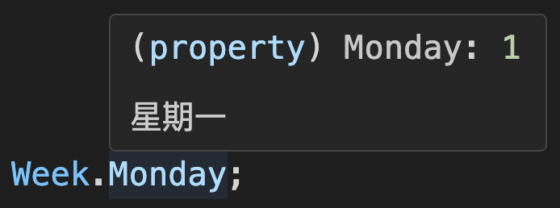

<!-- markdownlint-disable MD001 MD009 MD033 MD041 -->

[English](./README.md) | [中文](./README.zh-CN.md)

<p align="center">
  <a href="https://github.com/shijistar/enum-plus" target="blank">
    
  </a>
</p>

<p align="center">
  <strong>像原生 enum 一样，但更强大！</strong>
</p>
<br/>

[](https://www.npmjs.com/package/enum-plus)
[](https://www.npmjs.com/package/enum-plus?activeTab=code)
[](https://codecov.io/gh/shijistar/enum-plus)
[](https://www.npmjs.com/package/enum-plus)


⬇️ &nbsp;&nbsp; [简介](#简介) | [特性](#特性) | [安装](#安装) | [枚举定义](#枚举定义) | [API](#api) | [用法](#用法) | [命名规范建议](#命名规范建议) | [本地化](#本地化) | [全局扩展](#全局扩展) | [兼容性](#兼容性) | [常见问题](#常见问题) | [贡献](#贡献) &nbsp;&nbsp; ⬇️

## 简介

`enum-plus`是一个增强版的枚举类库，完全兼容原生`enum`的基本用法，同时支持扩展显示文本、绑定到 UI 组件以及提供丰富的扩展方法，是原生`enum`的一个直接替代品。它是一个轻量级、零依赖、100% TypeScript 实现的工具，适用于多种前端框架，并支持本地化。

枚举项扩展了显示名称后，可以与枚举值用来一键生成下拉框、复选框等组件。通过枚举的扩展方法，可以轻松遍历枚举项数组，获取某个枚举值的显示文本，判断某个值是否存在等。枚举项的显示文本支持本地化，可以根据当前语言环境返回对应的文本，这样可以使得枚举项的显示文本更加灵活，更加符合用户的需求。

还有哪些令人兴奋的特性呢？请继续探索吧！或者不妨先看下这个使用视频。

<p align="center">
   
</p>

## 特性

- 完全兼容原生 `enum` 的用法
- 支持`number`、`string`等多种数据类型
- 增强的枚举项，支持自定义显示文本
- 内置`本地化`能力，枚举项文本可实现国际化，可与任何 i18n 库集成
- 支持枚举值转换为显示文本，代码更简洁
- 可扩展设计，允许在枚举项上添加自定义字段
- 支持将枚举绑定到 [Ant Design](https://ant-design.antgroup.com/components/overview-cn)、[ElementPlus](https://element-plus.org/zh-CN/component/select.html)、[Material-UI](https://mui.com/material-ui) 等 UI 库，一行代码枚举变下拉框
- 支持 Node.js 环境，支持服务端渲染(SSR)
- 零依赖，纯原生 JavaScript，可用于任何前端框架
- 100% TypeScript 实现，具有全面的类型推断能力
- 轻量(gzip 压缩后仅 2KB+)

## 安装

使用 npm 安装:

```bash
npm install enum-plus
```

使用 pnpm 安装:

```bash
pnpm add enum-plus
```

使用 bun 安装:

```bash
bun add enum-plus
```

或者使用 yarn:

```bash
yarn add enum-plus
```

**在浏览器中使用**:

- 特定版本:

```html
<!-- ES2020 现代版本 -->
<script src="https://cdn.jsdelivr.net/npm/enum-plus@v3.0.0/umd/enum-plus.min.js"></script>
<!-- ES2015 兼容版本 -->
<script src="https://cdn.jsdelivr.net/npm/enum-plus@v3.0.0/umd/enum-plus-legacy.min.js"></script>
```

- 最新版本:

```html
<!-- ES2020 现代版本 -->
<script src="https://cdn.jsdelivr.net/npm/enum-plus/umd/enum-plus.min.js"></script>
<!-- ES2015 兼容版本 -->
<script src="https://cdn.jsdelivr.net/npm/enum-plus/umd/enum-plus-legacy.min.js"></script>
```

⬇️ **下载文件**:

- [enum-plus.umd.min.js.gz](https://github.com/shijistar/enum-plus/releases/download/v3.0.0/enum-plus.umd.min.js.gz)
- [enum-plus.umd.tar.gz](https://github.com/shijistar/enum-plus/releases/download/v3.0.0/enum-plus.umd.tar.gz) (完整包，包含 sourcemap)
- [enum-plus-legacy.umd.min.js.gz](https://github.com/shijistar/enum-plus/releases/download/v3.0.0/enum-plus-legacy.umd.min.js.gz)
- [enum-plus-legacy.umd.tar.gz](https://github.com/shijistar/enum-plus/releases/download/v3.0.0/enum-plus-legacy.umd.tar.gz) (完整包，包含 sourcemap)

> 你也可以在 [Github 发布](https://github.com/shijistar/enum-plus/releases) 中下载这些文件

## 枚举定义

本节展示了使用 `Enum` 函数初始化枚举的多种方式，你可以根据不同的使用场景选择最合适的方法

### 1. 基础格式，与原生枚举用法基本一致

```js
import { Enum } from 'enum-plus';

const WeekEnum = Enum({
  Sunday: 0,
  Monday: 1,
} as const);

WeekEnum.Monday; // 1
```

> `as const` 类型断言用于将枚举值变成字面量类型，类型更精确，否则它们将被作为`number`类型。如果你使用的是JavaScript，请删除`as const`。

### 2. 基础格式，String 类型

与第一种方式类似，只不过枚举值是字符串类型

```js
import { Enum } from 'enum-plus';

const WeekEnum = Enum({
  Sunday: 'Sun',
  Monday: 'Mon',
} as const);

WeekEnum.Monday; // 'Mon'
```

### 3. 标准格式（推荐）

为每个枚举项指定 `value` (枚举值) 和 `label`（显示文本）字段，这是最常用的格式，也是推荐的格式。这种格式允许你为每个枚举项设置显示文本，这些文本可以在UI组件中使用。

```js
import { Enum } from 'enum-plus';

const WeekEnum = Enum({
  Sunday: { value: 0, label: '星期日' },
  Monday: { value: 1, label: '星期一' },
} as const);

WeekEnum.Sunday; // 0
WeekEnum.label(0); // 星期日
```

- ### 4. Label-Only 格式

当你希望使用`key`作为枚举值时，这种方式比较有用，此时`value`和`key`的值相同，`label`是显示文本

```js
import { Enum } from 'enum-plus';

const WeekEnum = Enum({
  Sunday: { label: '星期日' },
  Monday: { label: '星期一' },
} as const);

WeekEnum.Sunday; // 'Sunday'
WeekEnum.label('Sunday'); // 星期日
```

### 5. 数组格式

数组格式在需要动态创建枚举时很有用，例如从 API 获取数据中动态创建一个枚举。这种方式还允许[自定义字段映射](#自定义字段映射)，这增加了灵活性，可以适配不同的数据格式

```js
import { Enum } from 'enum-plus';

const petTypes = await getPetsData();
// [   { value: 1, key: 'dog', label: '狗' },
//     { value: 2, key: 'cat', label: '猫' },
//     { value: 3, key: 'rabbit', label: '兔子' }   ];
const PetTypes = Enum(petTypes);
```

### 6. 原生枚举格式

如果你已经有一个原生的枚举，你可以直接传递给`Enum`函数，它会自动转换为增强版的枚举，这样可以借用原生枚举的`枚举值自动递增`特性

```ts
import { Enum } from 'enum-plus';

enum init {
  Sunday = 0,
  Monday,
  Tuesday,
  Wednesday,
  Thursday,
  Friday,
  Saturday,
}
const WeekEnum = Enum(init);

WeekEnum.Sunday; // 0
WeekEnum.Monday; // 1
WeekEnum.Saturday; // 6
WeekEnum.label('Sunday'); // Sunday
```

## API

### 💎 &nbsp; 拾取枚举值

`Enum.XXX`

像原生`enum`一样，直接拾取一个枚举值

```js
WeekEnum.Sunday; // 0
WeekEnum.Monday; // 1
```

---

### 💎 &nbsp; items

`{ value, label, key, raw }[]`

获取一个包含全部枚举项的只读数组，可以方便地遍历枚举项。由于符合 [Ant Design](https://ant-design.antgroup.com/components/select-cn#usage-upgrade) 组件的数据规范，因此支持将枚举一键转换成下拉框、复选框等组件，只需要一行代码，更多详情可以参考后面的例子

---

### 💎 &nbsp; keys

`string[]`

获取一个包含全部枚举项`key`的只读数组

---

### 💎 &nbsp; label

<sup>**_\[方法]_**</sup> &nbsp; `label(keyOrValue?: string | number): string | undefined`

根据某个枚举值或枚举 key，获取该枚举项的显示文本。如果设置了本地化，则会返回本地化后的文本。

```js
WeekEnum.label(1); // 星期一
WeekEnum.label('Monday'); // 星期一
```

---

### 💎 &nbsp; key

<sup>**_\[方法]_**</sup> &nbsp; `key(value?: string | number): string | undefined`

根据枚举值获取该枚举项的 key，如果不存在则返回`undefined`

```js
WeekEnum.key(1); // 'Monday'
```

---

### 💎 &nbsp; has

<sup>**_\[方法]_**</sup> &nbsp; `has(keyOrValue?: string | number): boolean`

判断某个枚举项（值或 key）是否存在

```js
WeekEnum.has(1); // true
WeekEnum.has('Sunday'); // true
WeekEnum.has(9); // false
WeekEnum.has('Birthday'); // false
```

---

### 💎 &nbsp; toSelect

<sup>**_\[方法]_**</sup> &nbsp; `toSelect(config?: OptionsConfig): {value, label}[]`

`toSelect`与`items`相似，都是返回一个包含全部枚举项的数组。区别是，`toSelect`返回的元素只包含`label`和`value`两个字段，同时，`toSelect`方法支持在数组头部插入一个默认元素，一般用于下拉框等组件的默认选项，表示全部、无值或不限等，当然你也能够自定义这个默认选项

---

### 💎 &nbsp; toMenu

<sup>**_\[方法]_**</sup> &nbsp; `toMenu(): { key, label }[]`

生成一个对象数组，可以绑定给 [Ant Design](https://ant-design.antgroup.com/components/menu-cn#itemtype) 的`Menu`、`Dropdown`等组件

```js
import { Menu } from 'antd';

<Menu items={WeekEnum.toMenu()} />;
```

数据格式为：

```js
[
  { key: 0, label: '星期日' },
  { key: 1, label: '星期一' },
];
```

---

### 💎 &nbsp; toFilter

<sup>**_\[方法]_**</sup> &nbsp; `toFilter(): { text, value }[]`

生成一个对象数组，可以直接传递给 [Ant Design](https://ant-design.antgroup.com/components/table-cn#table-demo-head) Table 组件的列配置，在表头中显示一个下拉筛选框，用来过滤表格数据

数据格式为：

```js
[
  { text: '星期日', value: 0 },
  { text: '星期一', value: 1 },
];
```

---

### 💎 &nbsp; toValueMap

<sup>**_\[方法]_**</sup> &nbsp; `toValueMap(): Record<V, { text: string }>`

生成一个符合 [Ant Design Pro](https://pro-components.antdigital.dev/components/schema#valueenum) 规范的枚举集合对象，可以传递给 `ProFormField`、`ProTable` 等组件。

数据格式为：

```js
{
  0: { text: '星期日' },
  1: { text: '星期一' },
}
```

---

### 💎 &nbsp; raw

<sup>**_\[方法重载^1]_**</sup> &nbsp; `raw(): Record<K, T[K]>`
<br/>
<sup>**_\[方法重载^2]_**</sup> &nbsp; `raw(keyOrValue: V | K): T[K]`

第一个重载方法，返回枚举集合的初始化对象，即用来初始化 Enum 原始 init 对象。

第二个重载方法，用来处理单个枚举项，根据获取单个枚举项的原始初始化对象。

这个方法主要作用是，用来获取枚举项的自定义字段，支持无限扩展字段

```js
const WeekEnum = Enum({
  Sunday: { value: 0, label: '星期日', happy: true },
  Monday: { value: 1, label: '星期一', happy: false },
} as const);

WeekEnum.raw(0).happy // true
WeekEnum.raw(0); // { value: 0, label: '星期日', happy: true }
WeekEnum.raw('Monday'); // { value: 1, label: '星期一', happy: false }
WeekEnum.raw(); // { Sunday: { value: 0, label: '星期日', happy: true }, Monday: { value: 1, label: '星期一', happy: false } }
```

---

### ⚡️ &nbsp; valueType &nbsp;&nbsp;&nbsp; <sup>**_\[TypeScript ONLY]_**</sup>

`value1 | value2 | ...`

在 TypeScript 中，提供了一个包含所有枚举值的联合类型，用于缩小变量或组件属性的数据类型。这种类型替代了像 `number` 或 `string` 这样宽泛的原始类型，使用精确的值集合，防止无效赋值，同时提高代码可读性和编译时类型安全性。

```typescript
type WeekValues = typeof WeekEnum.valueType; // 0 | 1

const weekValue: typeof WeekEnum.valueType = 1; // ✅ 类型正确，1 是一个有效的周枚举值
const weeks: (typeof WeekEnum.valueType)[] = [0, 1]; // ✅ 类型正确，0 和 1 是有效的周枚举值
const badWeekValue: typeof WeekEnum.valueType = 8; // ❌ 类型错误，8 不是一个有效的周枚举值
const badWeeks: (typeof WeekEnum.valueType)[] = [0, 8]; // ❌ 类型错误，8 不是一个有效的周枚举值
```

> 注意，这只是一个 TypeScript 类型，只能用来约束类型，不可在运行时调用，运行时调用会抛出异常

---

### ⚡️ &nbsp; keyType &nbsp;&nbsp;&nbsp; <sup>**_\[TypeScript ONLY]_**</sup>

`key1 | key2 | ...`

与`valueType`类似，获取一个包含全部枚举 `key` 的联合类型

```typescript
type WeekKeys = typeof WeekEnum.keyType; // 'Sunday' | 'Monday'
const weekKey: typeof WeekEnum.keyType = 'Monday';
const weekKeys: (typeof WeekEnum.keyType)[] = ['Sunday', 'Monday'];
```

> 注意，这只是一个 TypeScript 类型，只能用来约束类型，不可在运行时调用，运行时调用会抛出异常

---

### ⚡️ &nbsp; rawType &nbsp;&nbsp;&nbsp; <sup>**_\[TypeScript ONLY]_**</sup>

`{ value: V, label: string, [...] }`

获取初始化整个枚举集合的原始类型，即用来创建枚举集合的对象。

与无参数的`raw`方法类似，只不过`raw`是一个运行时方法，而`rawType`是一个约束类型

> 注意，这只是一个 TypeScript 类型，只能用来约束类型，不可在运行时调用，运行时调用会抛出异常

---

## 用法

#### 拾取枚举值，与原生枚举用法一致

```js
const WeekEnum = Enum({
  Sunday: { value: 0, label: '星期日' },
  Monday: { value: 1, label: '星期一' },
} as const);

WeekEnum.Sunday; // 0
WeekEnum.Monday; // 1
```

---

#### 枚举项支持 Jsdoc 注释，启用代码智能提示

在代码编辑器中，将光标悬停在枚举项上，即可显示关于该枚举项的详细 Jsdoc 注释，而不必再转到枚举定义处查看

```js
const WeekEnum = Enum({
  /** 星期日 */
  Sunday: { value: 0, label: '星期日' },
  /** 星期一 */
  Monday: { value: 1, label: '星期一' },
} as const);

WeekEnum.Monday; // 将光标悬浮在 Monday 上
```



可以看到，不但提示了枚举项的释义，还有枚举项的值，无需跳转离开当前光标位置，在阅读代码时非常方便

---

#### 获取包含全部枚举项的数组

```js
WeekEnum.items; // 输出如下:
// [
//  { value: 0, label: '星期日', key: 'Sunday', raw: { value: 0, label: '星期日' } },
//  { value: 1, label: '星期一', key: 'Monday', raw: { value: 1, label: '星期一' } }
// ]
```

---

#### 获取第一个枚举值

```js
WeekEnum.items[0].value; // 0
```

---

#### 检查一个值是否一个有效的枚举值

```js
WeekEnum.has(1); // true
WeekEnum.items.some((item) => item.value === 1); // true
1 instanceof WeekEnum; // true
```

---

#### `instanceof` 操作符

```js
1 instanceof WeekEnum; // true
'1' instanceof WeekEnum; // true
'Monday' instanceof WeekEnum; // true
```

---

#### 支持遍历枚举项数组，但不可修改

```js
WeekEnum.items.length; // 2
WeekEnum.items.map((item) => item.value); // [0, 1]，✅ 可遍历
WeekEnum.items.forEach((item) => {}); // ✅ 可遍历
for (const item of WeekEnum.items) {
  // ✅ 可遍历
}
WeekEnum.items.push({ value: 2, label: '星期二' }); // ❌ 不可修改
WeekEnum.items.splice(0, 1); // ❌ 不可修改
WeekEnum.items[0].label = 'foo'; // ❌ 不可修改
```

---

#### 枚举值(或key)转换为显示文本

```js
WeekEnum.label(1); // 星期一，
WeekEnum.label(WeekEnum.Monday); // 星期一
WeekEnum.label('Monday'); // 星期一
```

---

#### 枚举值转换为key

```js
WeekEnum.key(1); // 'Monday'
WeekEnum.key(WeekEnum.Monday); // 'Monday'
WeekEnum.key(9); // undefined, 不存在此枚举项
```

---

#### 添加扩展字段，不限数量

```js
const WeekEnum = Enum({
  Sunday: { value: 0, label: '星期日', active: true, disabled: false },
  Monday: { value: 1, label: '星期一', active: false, disabled: true },
} as const);

WeekEnum.raw(0).active // true
WeekEnum.raw(WeekEnum.Sunday).active // true
WeekEnum.raw('Sunday').active // true
```

---

#### 转换成 UI 组件

- `Enum.items` 可以直接作为组件的数据源（以 Select 组件为例）

  **React相关框架**

  [Ant Design](https://ant-design.antgroup.com/components/select-cn) | [Arco Design](https://arco.design/react/components/select)
  Select

  ```tsx
  import { Select } from 'antd';

  <Select options={WeekEnum.items} />;
  ```

  [Material-UI](https://mui.com/material-ui/react-select/) Select

  ```tsx
  import { MenuItem, Select } from '@mui/material';

  <Select>
    {WeekEnum.items.map((item) => (
      <MenuItem key={item.value} value={item.value}>
        {item.label}
      </MenuItem>
    ))}
  </Select>;
  ```

  [Kendo UI](https://www.telerik.com/kendo-react-ui/components/dropdowns/dropdownlist) Select

  ```tsx
  import { DropDownList } from '@progress/kendo-react-dropdowns';

  <DropDownList data={WeekEnum.items} textField="label" dataItemKey="value" />;
  ```

  **Vue相关框架**

  [ElementPlus](https://element-plus.org/zh-CN/component/select.html) Select

  ```tsx
  <el-select>
    <el-option v-for="item in WeekEnum.items" v-bind="item" />
  </el-select>
  ```

  [Ant Design Vue](https://antdv.com/components/select-cn) | [Arco Design](https://arco.design/vue/component/select) Select

  ```tsx
  <a-select :options="WeekEnum.items" />
  ```

  [Vuetify](https://vuetifyjs.com/zh-Hans/components/selects) Select

  ```tsx
  <v-select :items="WeekEnum.items" item-title="label" />
  ```

  **Angular相关框架**

  [Angular Material](https://material.angular.io/components/select/overview) Select

  ```html
  <mat-select>
    @for (item of WeekEnum.items; track item.value) {
      <mat-option [value]="item.value">{{ item.label }}</mat-option>
    }
  </mat-select>
  ```

  [NG-ZORRO](https://ng.ant.design/components/select/zh) Select

  ```html
  <nz-select>
    @for (item of WeekEnum.items; track item.value) {
      <nz-option [nzValue]="item.value">{{ item.label }}</nz-option>
    }
  </nz-select>
  ```

- `toSelect`方法与`items`类似，但允许在头部增加一个默认选项。默认选项可以是一个布尔值，也可以是一个自定义对象。

  - 如果是布尔值，则默认选项为`{ value: '', label: 'All' }`，显示名称只支持英文。如果希望支持本地化，请在本地化方法中解析并处理`enum-plus.options.all`这个内置资源。关于本地化的更多详情，请参考[本地化](#本地化)章节
  - 如果是一个对象，则可以自定义默认选项的值和显示文本，显示文本会自动支持本地化

  ```tsx
  <Select options={WeekEnum.toSelect({ firstOption: true })} />
  // [
  //  { value: '', label: 'All' },
  //  { value: 0, label: '星期日' },
  //  { value: 1, label: '星期一' }
  // ]

  // 自定义头部默认选项
  <Select options={WeekEnum.toSelect({ firstOption: { value: 0, label: '不限' } })} />
  ```

- `toMenu`方法可以为 [Ant Design](https://ant-design.antgroup.com/components/menu-cn#itemtype) `Menu`、`Dropdown` 等组件生成数据源，格式为：`{ key: number|string, label: string } []`

```tsx
import { Menu } from 'antd';

<Menu items={WeekEnum.toMenu()} />;
```

- `toFilter`方法可以生成一个对象数组，为表格绑定`列筛选`功能，列头中显示一个下拉筛选框，用来过滤表格数据。对象结构遵循 [Ant Design](https://ant-design.antgroup.com/components/table-cn#table-demo-head) 的数据规范，格式为：`{ text: string, value: number|string } []`

```tsx
import { Table } from 'antd';

const columns = [
  {
    title: 'week',
    dataIndex: 'week',
    filters: WeekEnum.toFilter(),
  },
];
// 在表头中显示下拉筛选项
<Table columns={columns} />;
```

- `toValueMap`方法可以为 [Ant Design Pro](https://pro-components.antdigital.dev/components/schema#valueenum) 的`ProFormFields`、`ProTable`等组件生成数据源，这是一个类似 Map 的数据结构，格式为：`{ [key: number|string]: { text: string } }`

```tsx
import { ProFormCheckbox, ProFormRadio, ProFormSelect, ProFormTreeSelect } from '@ant-design/pro-components';

<ProFormSelect valueEnum={WeekEnum.toValueMap()} />; // 下拉框
<ProFormCheckbox valueEnum={WeekEnum.toValueMap()} />; // 复选框
<ProFormRadio.Group valueEnum={WeekEnum.toValueMap()} />; // 单选框
<ProFormTreeSelect valueEnum={WeekEnum.toValueMap()} />; // 树选择
```

---

#### 两个枚举合并（或者扩展某个枚举）

```js
const myWeek = Enum({
  ...WeekEnum.raw(),
  Friday: { value: 5, label: '星期五' },
  Saturday: { value: 6, label: '星期六' },
});
```

---

#### 使用枚举值序列来缩小 `number` 取值范围 &nbsp;&nbsp;<sup>_\[TypeScript ONLY]_</sup>

使用`valueType`类型约束，你可以将变量类型从宽泛的基本类型（如`number`或`string`）精确缩小为枚举值的联合类型。这种类型缩窄不仅能在编译时防止无效赋值，还能增强代码的可读性和自文档化能力，同时提供更强的类型安全保障

```typescript
const weekValue: number = 8; // 👎 任意数字都可以赋值给周枚举，即使错误的
const weekName: string = 'Birthday'; // 👎 任意字符串都可以赋值给周枚举，即使错误的

const goodWeekValue: typeof WeekEnum.valueType = 1; // ✅ 类型正确，1 是一个有效的周枚举值
const goodWeekName: typeof WeekEnum.keyType = 'Monday'; // ✅ 类型正确，'Monday' 是一个有效的周枚举名

const badWeekValue: typeof WeekEnum.valueType = 8; // ❌ 类型错误，8 不是一个有效的周枚举值
const badWeekName: typeof WeekEnum.keyType = 'Birthday'; // ❌ 类型错误，'Birthday' 不是一个有效的周枚举名

type FooProps = {
  value?: typeof WeekEnum.valueType; // 👍 组件属性类型约束，可以防止错误赋值，还能智能提示有效值有哪些
  names?: (typeof WeekEnum.keyType)[]; // 👍 组件属性类型约束，可以防止错误赋值，还能智能提示有效值有哪些
};
```

---

#### 自定义字段映射

在 [5. 数组格式](#5-数组格式) 章节中，介绍了可以通过后端动态数据来构建枚举，但是很可能动态数据的字段名并不是`value`、`label`、`key`，而是其它的字段名。这时你可以传入一个自定义选项，把这些映射到其它字段名上

```js
import { Enum } from 'enum-plus';

const petTypes = await getPetsData();
// [   { id: 1, code: 'dog', name: '狗' },
//     { id: 2, code: 'cat', name: '猫' },
//     { id: 3, code: 'rabbit', name: '兔子' }   ];
const PetTypes = Enum(petTypes, {
  getValue: 'id',
  getLabel: 'name',
  getKey: 'code', // getKey可选
});
WeekEnum.items; // 输出如下:
// [   { value: 1, label: '狗', key: 'dog' },
//     { value: 2, label: '猫', key: 'cat' },
//     { value: 3, label: '兔子', key: 'rabbit' }   ]
```

在上面的例子中，`getValue`、`getLabel`、`getKey` 还可以是一个函数，用来处理更复杂的业务逻辑，比如：

```js
const PetTypes = Enum(petTypes, {
  getValue: (item) => item.id,
  getLabel: (item) => `${item.name} (${item.code})`,
  getKey: (item) => item.code,
});
```

---

#### 命名冲突？

这里为枚举使用添加一些边界情况，从上面的用例中可以看到，我们可以通过 `WeekEnum.XXX` 来快捷访问枚举项，但是万一枚举项的 key 与枚举方法命名冲突怎么办？

我们知道枚举类型上还存在 `label`、`key`、`toSelect` 等方法，如果与某个枚举项重名，枚举项的值优先级更高，会覆盖掉这些方法。但不用担心，你可以在 `items` 下访问到它们。请参考下面的代码示例：

```js
const WeekEnum = Enum({
  foo: { value: 1 },
  bar: { value: 2 },
  keys: { value: 3 }, // 命名冲突
  label: { value: 4 }, // 命名冲突
} as const);

WeekEnum.keys; // 3，枚举项优先级更高，会覆盖掉方法
WeekEnum.label; // 4，枚举项优先级更高，会覆盖掉方法
// 可以通过 Enum.items 访问到这些方法 🙂
WeekEnum.items.keys; // ['foo', 'bar', 'keys', 'label']
WeekEnum.items.label(1); // 'foo'
```

更极端一些，万一`items`与枚举项命名冲突怎么办？放心，你仍然可以通过别名字段访问到`items`数组。参考下面的示例：

```js
import { ITEMS } from 'enum-plus';

const WeekEnum = Enum({
  foo: { value: 1 },
  bar: { value: 2 },
  items: { value: 3 }, // 命名冲突
} as const);

WeekEnum.items; // 3，枚举项优先级更高，会覆盖掉 items
WeekEnum[ITEMS]; // ITEMS 是一个别名Symbol
// [
//  { value: 1, key: 'foo', label: 'foo' },
//  { value: 2, key: 'bar', label: 'bar' },
//  { value: 3, key: 'items', label: 'items' }
// ]
// 等价于原来的 WeekEnum.items 🙂
```

---

## 命名规范建议

1. **枚举类型命名：** 采用 `PascalCase` 大驼峰命名法，并以 `Enum` 作为后缀，如 _WeekEnum_、_ColorEnum_ 等。
2. **枚举成员命名：**使用 `PascalCase` 大驼峰命名法，如 _WeekEnum.Sunday_、_ColorEnum.Red_ 等。此命名方式突显了枚举成员的不可变性与静态特性，且在IDE智能提示中会在顶部显示，更方便拾取。
3. **语义明确：** 确保枚举和成员名称具有清晰的语义，良好的语义命名能够自解释代码意图，降低理解成本。
4. **单一职责原则：** 每个枚举类型应专注表达一组高内聚的相关常量，避免不同枚举类型之间的职责重叠。
5. **提供JSDoc注释：** 为每个枚举项添加 Jsdoc 注释，说明其含义和用途。完善的JSDoc文档能在IDE中提供悬停提示，提升代码阅读体验。同样也建议为枚举类添加注释。
6. **国际化架构：** 建议从开始就搭建国际化架构，可集成本库提供的 [本地化](#本地化) 机制。预先设计的国际化方案能够避免后期重构的高成本，并使应用更易于扩展到全球市场。

---

## 本地化

`enum-plus` 本身不内置国际化能力，但支持通过 `localize` 可选参数传入一个自定义方法，来实现本地化文本的转化。这是一个非常灵活的方案，这使你能够实现自定义的本地化函数，根据当前的语言环境将枚举的 `label` 值转换为适当的翻译文本。语言状态管理仍由你自己负责，你的 `localize` 方法决定返回哪种本地化文本。对于生产环境的应用程序，我们强烈建议使用成熟的国际化库（如 `i18next`），而不是创建自定义解决方案。

以下是一个简单的示例，仅供参考。请注意，第一种方法由于缺乏灵活性，不建议在生产环境中使用，它仅用于演示基本概念。请考虑使用第二种及后面的示例。

```tsx
import { Enum } from 'enum-plus';
import i18next from 'i18next';
import Localize from './Localize';

let lang = 'zh-CN';
const setLang = (l: string) => {
  lang = l;
};

// 👎 这不是一个好例子，仅供演示，不建议生产环境使用
const sillyLocalize = (content: string) => {
  if (lang === 'zh-CN') {
    switch (content) {
      case 'enum-plus.options.all':
        return '全部';
      case 'week.sunday':
        return '星期日';
      case 'week.monday':
        return '星期一';
      default:
        return content;
    }
  } else {
    switch (content) {
      case 'enum-plus.options.all':
        return 'All';
      case 'week.sunday':
        return 'Sunday';
      case 'week.monday':
        return 'Monday';
      default:
        return content;
    }
  }
};
// 👍 建议使用 i18next 或其他国际化库
const i18nLocalize = (content: string | undefined) => i18next.t(content);
// 👍 或者封装成一个基础组件
const componentLocalize = (content: string | undefined) => <Localize value={content} />;

const WeekEnum = Enum(
  {
    Sunday: { value: 0, label: 'week.sunday' },
    Monday: { value: 1, label: 'week.monday' },
  } as const,
  {
    localize: sillyLocalize,
    // localize: i18nLocalize, // 👍 推荐使用i18类库
    // localize: componentLocalize, // 👍 推荐使用组件形式
  }
);
setLang('zh-CN');
WeekEnum.label(1); // 星期一
setLang('en-US');
WeekEnum.label(1); // Monday
```

当然，每个枚举类型都这样设置可能比较繁琐，`enum-plus` 提供了一种全局设置方案，可以通过 `Enum.localize` 全局方法，来全局设置本地化。如果两者同时存在，单个枚举的设置会覆盖全局设置。

```js
Enum.localize = i18nLocalize;
```

---

## 全局扩展

虽然 `Enum` 提供了一套全面的内置方法，但如果这些还不能满足你的需求，你可以使用 `Enum.extends` API 扩展其功能，添加自定义方法。这些扩展会全局应用于所有枚举实例，包括在扩展应用之前创建的实例，并且会立即生效，无需任何其它设置。

_**App.ts**_

```tsx
Enum.extends({
  toMySelect(this: ReturnType<typeof Enum>) {
    return this.items.map((item) => ({ value: item.value, title: item.label }));
  },
  reversedItems(this: ReturnType<typeof Enum>) {
    return this.items.reverse();
  },
});

WeekEnum.toMySelect(); // [{ value: 0, title: '星期日' }, { value: 1, title: '星期一' }]
```

如果你在使用 TypeScript，你可能需要再扩展一下枚举类型声明，这样可以获得更好的类型提示。在你的项目中创建或编辑一个声明文件（例如 `global.d.ts`），并在其中扩展全局类型。此文件可以放在项目的根目录或任意目录下，只要确保 TypeScript 能够找到它

_**global.d.ts**_

```tsx
import type { EnumItemInit } from 'enum-plus';
import type { EnumItemClass } from 'enum-plus/lib/enum-item';

declare global {
  export interface EnumExtension<T, K, V> {
    toMySelect: () => { value: V; title: string }[];
    reversedItems: () => EnumItemClass<EnumItemInit<V>, K, V>[];
  }
}
```

请注意，你不是必须导入`EnumItemInit`和`EnumItemClass`这些类型，这些仅在这个示例中被使用，为了添加更友好的类型提示。

`EnumExtension`接口是一个泛型接口，它接受三个类型参数，分别是：

- `T`: 枚举类型的初始化对象
- `K`: 枚举项的键值
- `V`: 枚举项的值

如果你希望在扩展方法中提供更友好的类型提示，你或许可能需要使用到这些类型参数，但这些都是可选的，如果你不需要，可以直接省略掉它们

---

## 兼容性

enum-plus 设计之初就考虑了广泛的兼容性需求，可无缝运行于各类环境，包括现代浏览器、Node.js 以及多种构建工具。下面详细说明各环境的兼容性情况：

### 浏览器环境

- **现代打包工具**：对于支持 [exports](https://nodejs.org/api/packages.html#exports-sugar) 字段的打包工具（如 webpack 5+、vite、rollup），引入的是 `es` 目录，对应的 EcmaScript 版本是 **`ES2020`**。如果需要支持更早期的浏览器，可以在构建过程中使用 `@babel/preset-env` 转译为更早期的语法。

- **旧版打包工具**：对于不支持 [exports](https://nodejs.org/api/packages.html#exports-sugar) 字段的工具（如 webpack 4），enum-plus 会自动回退到 `main` 字段的入口点，引入的是 `es-legacy` 目录，对应的 EcmaScript 版本是 **`ES2015`**。

- **UMD版本**：为了方便在浏览器中直接使用，或者方便在没有打包工具的静态项目中使用，enum-plus 还提供了 UMD 版本，存放在 `umd` 目录下。UMD 格式的文件可以通过 `<script>` 标签直接引入，通过 `window.EnumPlus` 获取类库内容。umd 目录提供了两种版本：

  - `enum-plus.min.js`：对应的 EcmaScript 版本是 **`ES2020`**，适用于现代浏览器
  - `enum-plus-legacy.min.js`：对应的 EcmaScript 版本是 **`ES2015`**，适用于旧版浏览器

> **Polyfill 策略**：为了最小化包的体积，除了 UMD 格式，enum-plus 不包含任何 polyfill。如果需要支持旧版浏览器，可以自行引入以下工具：
>
> - `core-js`
> - 配置适当的 `@babel/preset-env` 和 `useBuiltIns` 设置
> - 其他替代的 polyfill 实现

### Node.js 环境

在 Node.js 环境下，默认引入的是 `lib` 目录，对应的 EcmaScript 版本是 **`ES2016`**，可以兼容 Node.js `v7.x` 及以上版本

---

## 常见问题

### 1. 如何基于 i18next 实现国际化？

请参考下面的示例代码：

_main.tsx_

```tsx
import { createRoot } from 'react-dom/client';
import { Enum } from 'enum-plus';
import i18next from 'i18next';
import App from './App';
import Locale from './components/Locale';
import LocaleProvider from './components/LocaleProvider';
import enUS from './locales/en-US';
import zhCN from './locales/zh-CN';

i18next.init({
  lng: localStorage.getItem('my_lang'),
  fallbackLng: 'en-US',
  supportedLngs: ['en-US', 'zh-CN'],
  resources: {
    'en-US': { translation: enUS },
    'zh-CN': { translation: zhCN },
  },
});
i18next.on('languageChanged', (lang) => {
  localStorage.setItem('my_lang', lang);
});

// 👀 这里是关键代码，通过 Enum.localize 方法全局设置，使用 Locale 组件来输出本地化文本
Enum.localize = (key?: string) => <Locale value={key} />;

const root = createRoot(document.getElementById('root'));
root.render(
  <LocaleProvider>
    <App />
  </LocaleProvider>
);
```

_components/LocaleProvider.tsx_

```tsx
import type { FC, ReactNode } from 'react';
import { createContext, useEffect, useState } from 'react';
import i18next from 'i18next';

export const LocaleContext = createContext<{
  lang: string;
  setLang: (lang: string) => void;
}>({});

const LocaleProvider: FC<{ children: ReactNode }> = ({ children }) => {
  const [lang, setLang] = useState(i18next.language);

  useEffect(() => {
    i18next.changeLanguage(lang);
  }, [lang]);
  return <LocaleContext.Provider value={{ lang, setLang }}>{children}</LocaleContext.Provider>;
};
export default LocaleProvider;
```

_components/Locale.tsx_

```tsx
import { useContext } from 'react';
import i18next from 'i18next';
import { LocaleContext } from './LocaleProvider';

export default function Localize({ value }: { value: string }) {
  const { lang } = useContext(LocaleContext);
  return <>{i18next.t(value, { lng: lang })}</>;
}
```

### 2. 实现国际化后，为什么antd下拉框的搜索功能失效了？

这是因为 antd 下拉框的内置搜索功能是基于 `label` 值来实现的，只能支持常规字符串。而支持了国际化后，`label` 实际返回的是一个组件，而不是常规字符串，因此 antd 无法正确进行字符串匹配。解决方法是可以给枚举扩展一个 `filterOption` 方法，帮助 Select 组件自定义搜索功能，这样就可以正确地支持搜索功能了。

参考下面的示例代码：

```tsx
import { Select } from 'antd';
import { Enum, type EnumItemClass } from 'enum-plus';

Enum.extends({
  filterOption: (search?: string, option?: EnumItemClass<number | string>) => {
    const label = $t(option?.raw?.label ?? '') ?? option?.value;
    return !search || label?.toUpperCase().includes(search.toUpperCase());
  },
});

// <Select options={WeekEnum.items} filterOption={WeekEnum.filterOption} />;
```

## 贡献

如果你想为这个项目做出贡献，请遵循仓库中的 [CONTRIBUTING](CONTRIBUTING.md) 指南。 欢迎提交问题、拉取请求或改进建议。我们非常感谢你的贡献！

如果你发现安全问题，请遵循 [安全策略](SECURITY.md) 来负责任地报告。

如果你觉得这个项目有用，请考虑在 GitHub 上给它一个星标 ⭐️。这有助于其他人发现这个项目，并鼓励我们继续开发。
